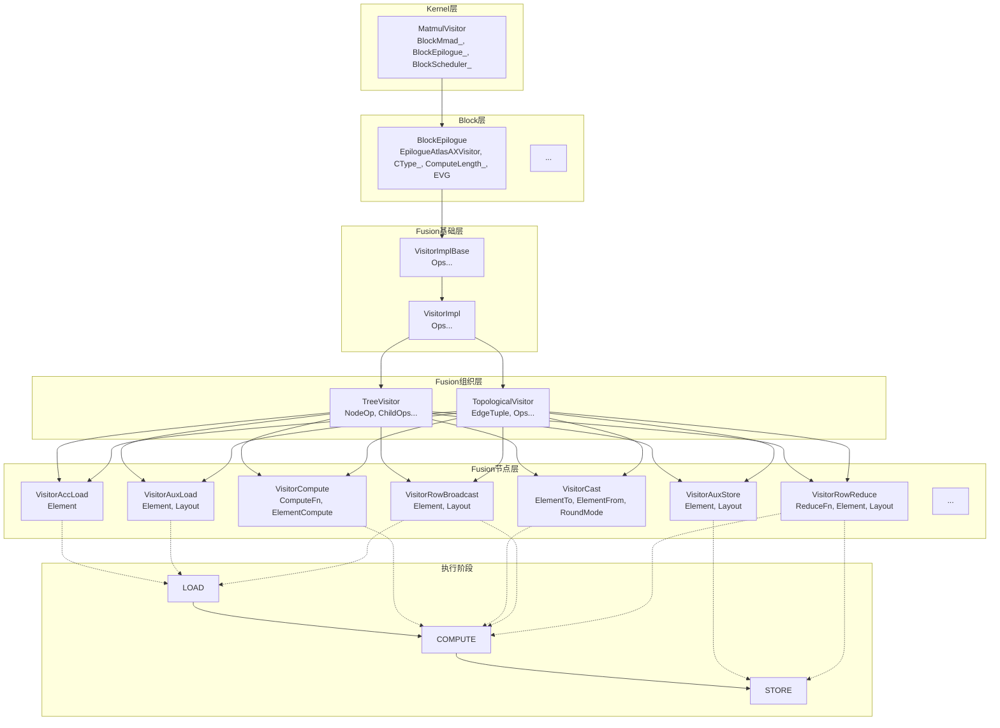

# Catlass Epilogue Visitor Graph（EVG）简要设计文档

---
> **EVG（Epilogue Visitor Graph）** 是 [Catlass](https://gitcode.com/cann/catlass) 中用于 GEMM 后处理（Epilogue）的声明式框架。它将后处理操作（如加法、类型转换、广播、规约等）抽象为可组合的模板节点，通过树形或拓扑结构拼接，形成计算图。开发者只需用"表达式"声明计算逻辑（如 `D = C + X`），框架自动处理数据搬运、UB 空间分配、事件同步和流水调度。相比手工组织 GM/UB 拷贝和事件同步，EVG 显著降低开发复杂度，同时以尽量保持相近性能为目标，并支持图和节点复用与灵活扩展。

[TOC]

---

## 1. 简介

### 背景
Catlass是面向AscendC的模板库，为NPU提供高效的矩阵运算能力。在GEMM（General Matrix Multiply）运算中，Epilogue阶段负责对矩阵乘法结果进行后处理，使用EVG可以将后处理操作抽象为模板节点的任意拼接，实现灵活的组合与复用。

### 核心挑战
- **算子多样性**：Epilogue算子种类繁多（加法、类型转换、行广播、行规约等），需要统一组织与复用机制。
- **UB空间受限**：AscendC的Unified Buffer空间有限，需精细管理UB分配与流水，避免空间浪费。
- **并发同步复杂**：MTE2/MTE3与V流水线并发执行，事件同步方向易错，需要清晰的同步语义。
- **组合复杂性**：不同应用场景需要不同的算子组合，需要支持任意拼接与嵌套。

### EVG应对策略

#### 1. 模板节点任意拼接
- **TreeVisitor**：支持树形结构的节点组合，父节点可以依赖多个子节点
- **TopologicalVisitor**：支持DAG拓扑结构，允许节点有多个消费者，如`(C+X)+(C+X)`中的`(C+X)`
- **嵌套组合**：支持任意深度的嵌套组合

#### 2. 三阶段语义
- **LOAD阶段**：数据从GM加载到UB，包括AccLoad、AuxLoad等
- **COMPUTE阶段**：在UB中进行计算，包括Compute、Cast等操作
- **STORE阶段**：将结果写回GM，包括AuxStore等

#### 3. 资源管理
- **UB自动分配**：根据节点类型和计算长度自动分配UB空间
- **双缓冲流水**：通过三阶段分阶段执行与事件同步实现数据搬运与计算尽量并行
- **类型安全**：通过模板参数确保类型安全，支持混合精度计算过程

#### 4. 灵活的复用机制
- **节点缓存**：TopologicalVisitor支持节点输出缓存，避免重复计算
- **参数复用**：支持同一节点在不同位置使用不同参数
- **模板特化**：针对不同硬件特性进行模板特化优化

## 2. 系统设计方案概述

以下是EVG的分层架构设计图，包括Kernel层、Block层和Fusion层三部分内容，体现各个节点族与阶段映射的特征。

关于各分层的详细内容及实现逻辑请参考[API指南](./evg_api.md)。

