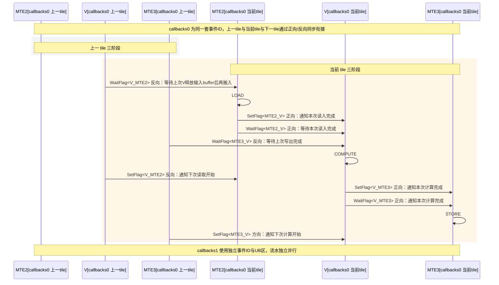
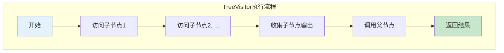
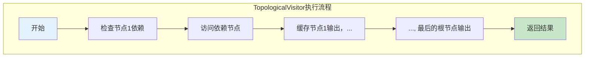
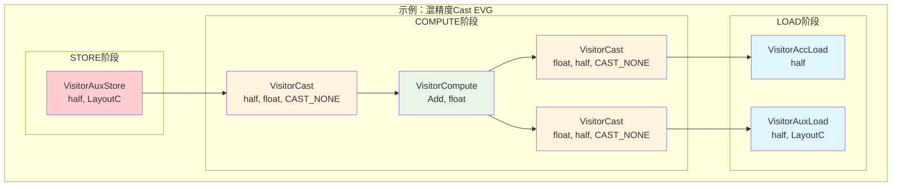

# 常见EVG API 参考

---
> 本文介绍EVG（Epilogue Visitor Graph）的API(详情可见[下表](#常用API简表))，您可先行参考[快速入门](./evg_quickstart.md)以上手EVG开发实践。

[TOC]

---

## 常用API简表
| API Name| Class Template | Features |
|-----------|----------------|----------|
| MatmulVisitor | `Gemm::Kernel::MatmulVisitor<BlockMmad_, BlockEpilogue_, BlockScheduler_>` | EVG入参桥接、Workspace组织 |
| BlockEpilogue | `Epilogue::Block::BlockEpilogue<EpilogueAtlasAXVisitor, CType_, ComputeLength_, EVG>` | Tile划分、双缓冲、事件同步 |
| Fusion Base | `Epilogue::Fusion::VisitorImplBase<Ops...>` | Arguments/Params汇聚、workspace计量、can_implement校验 |
| Fusion Impl | `Epilogue::Fusion::VisitorImpl<Ops...>` | 节点规范、get_callbacks统一构建、Callbacks生命周期钩子 |
| Tree Visitor | `Epilogue::Fusion::TreeVisitor<NodeOp, ChildOps...>` | 树形模板，父后子先遍历，按阶段传递子输出 |
| Topological Visitor | `Epilogue::Fusion::TopologicalVisitor<EdgeTuple, Ops...>` | DAG拓扑复用与节点缓存，根节点驱动全图 |
| Compute | `Epilogue::Fusion::VisitorCompute<ComputeFn, ElementCompute>` | 逐元素算子（如Add/Max/min） |
| Cast | `Epilogue::Fusion::VisitorCast<ElementTo, ElementFrom, RoundMode>` | 类型转换（含RoundMode） |
| Acc Load | `Epilogue::Fusion::VisitorAccLoad<Element>` | 从GEMM Block块工作区块按局部坐标Load |
| Aux Load | `Epilogue::Fusion::VisitorAuxLoad<Element, Layout>` | 从用户GM按全局坐标Load |
| Aux Store | `Epilogue::Fusion::VisitorAuxStore<Element, Layout>` | 写回用户GM（STORE阶段） |
| Row Broadcast | `Epilogue::Fusion::VisitorRowBroadcast<Element, Layout>` | 1xN行向量广播到MxN tile |
| Row Reduce | `Epilogue::Fusion::VisitorRowReduce<ReduceFn, Element, Layout>` | 按行规约到1xN并原子加到GM |
| ... | ... | ... |

## 多级API介绍 

### 2.1 Kernel级API

在Kernel层级，利用[`MatmulVisitor`](../../include/catlass/gemm/kernel/matmul_visitor.hpp)接收EVG入参，并组织Workspace大小。后处理过程将在每次AIC完成一次分块计算后进行。

开发者完成`EVG`定义后，会先后执行以下过程：
- 用户以 EVG 定义后处理，并构造 `EVG::Arguments evg_args`；
- 将`problemShape, ptrA, ptrB, evg_args` 打包为 `MatmulVisitor::Arguments`的实例对对象`arguments`；
- 对`Matmul`实例对象`matmulOp`调用`GetWorkspaceSize()`（应当为GEMM的C工作区和EVG所需的`workspace`的对齐和），内部会调用`MatmulVisitor`的`initalize_workspace()`；
- 调用 `ToUnderlyingArguments`：先进行常规参数传递（如 A/B/C 的布局与`workspace`），再通过`EVG::to_underlying_arguments`向Fusion层传参；
- AIC完成小块A,B矩阵乘并写入结果矩阵C(workspace)；跨核标志位使能后AIV执行`BlockEpilogue`。
- 在`end_epilogue`场景可能需要在最后进行`BlockEpilogue.end()`或者在`BlockEpilogue`的析构进行(内部进行）。

这部分对应代码为：

<details>
<summary><strong>Kernel层调用</strong></summary>

*以下是使用后处理过程在Kernel层调用的示例*
```cpp
// ...
// 准备evg_args(EVG::Arguments)

// ...
// 使用`MatmulVisitor`特化`MatmulKernel`
using BlockScheduler = typename Gemm::Block::GemmIdentityBlockSwizzle<3, 0>;
using MatmulKernel = Gemm::Kernel::MatmulVisitor<BlockMmad, BlockEpilogue, BlockScheduler>;
// Prepare params
typename MatmulKernel::Arguments arguments{options.problemShape, deviceA, deviceB, evg_args};
using MatmulAdapter = Gemm::Device::DeviceGemm<MatmulKernel>;
MatmulAdapter matmulOp;
size_t sizeWorkspace = matmulOp.GetWorkspaceSize(arguments);
uint8_t *deviceWorkspace{nullptr};
if (sizeWorkspace > 0) {
    ACL_CHECK(aclrtMalloc(reinterpret_cast<void **>(&deviceWorkspace), sizeWorkspace, ACL_MEM_MALLOC_HUGE_FIRST)
    );
}
matmulOp.Initialize(arguments, deviceWorkspace);
matmulOp(stream, aicCoreNum, fftsAddr);       // 开启Matmul+Epilogue计算
ACL_CHECK(aclrtSynchronizeStream(stream));
if (sizeWorkspace > 0) {
    ACL_CHECK(aclrtFree(deviceWorkspace));
}
```
</details>

### 2.2 Block级API

以下是Block级的双缓冲六流水（callbacks0 上一 tile 三条 + 当前 tile 三条），同步关系（按生产/消费语义）的示意图。



在顶层文件中，完成对[`Epilogue::Block::BlockEpilogue`](../../include/catlass/epilogue/block/block_epilogue.hpp)的拼接即完成了Block一级的后处理构建。
```cpp
using BlockEpilogue = Epilogue::Block::BlockEpilogue<Epilogue::EpilogueAtlasA2Visitor, CType,tla::Int<computeLength>, EVG>;
```
在运行阶段，其对应的执行过程如下：

- 初始构造：`BlockEpilogue(resource, {evg_params})`初始构造后即分配事件ID并设置初始 `flag`（允许 `MTE2` 搬入与 `V` 写出）；
- 子块划分：按子核维度将分块结果(Block C)拆成子块；
- 为双缓冲分配两套 `Callbacks`：通过 `evg.get_callbacks(resource, ub_offset, COMPUTE_LENGTH, ...)` 申请 UB 片段，并构建各 `Visitor` 回调；
- 进入Tile级循环：交替选择 `callbacks0/1`，按事件次序发起三阶段：
  - `LOAD`：Wait V_MTE2 → visit(..., LOAD) → Set MTE2_V；
  - `COMPUTE`：Wait MTE2_V & MTE3_V → visit(..., COMPUTE) → Set V_MTE2 & V_MTE3；
  - `STORE`：Wait V_MTE3 → visit(..., STORE) → Set MTE3_V；
- `callbacks0/1`交替进行，形成搬入/计算/搬出并行的双缓冲流水。

需要注意，在Block一级，`computeLength`规约了`block_epilogue`的计算粒度。它是单次在 UB 内参与计算的元素数量，决定了每个子块在“拷贝 → 计算 → 回写”流水中的 tile 大小。

以[`Matmul+Add`](./evg_quickstart.md#matmuladd算子开发)算子后处理为例，computeLength取值设计为：

```cpp
constexpr uint32_t computeLength = Epilogue::EpilogueAtlasA2Visitor::ArchTag::UB_SIZE /3/2/sizeof(half);
```

由于`UB`上可能同时访问C、X、D三段UB空间，且启用了双缓存机制，因此`computeLength`计算如上。`computeLength`确定后，可计算出最大`tile_shape`，以该粒度迭代进行C子块的处理，每个节点以`tile_shape`大小与UB进行数据传递(默认`layout::RowMajor`)。

### 2.3 Fusion级API

在该级，[`Epilogue::Fusion::TreeVisitor`](../../include/catlass/epilogue/fusion/tree_visitor.hpp)和[`Epilogue::Fusion::TopologicalVisitor`](../../include/catlass/epilogue/fusion/)是组织后处理计算图、管理资源节点的重要管理模板，二者的执行流程如下：




使用`TreeVisitor`/`TopologicalVisitor`描述计算图的关键特征有：
- 按树的父子关系嵌套，或以 `Edges` 指定拓扑；
- 根据各 `Visitor` 的 `Arguments` 顺序构造 `EVG::Arguments`；

常用数据/计算节点的API如下表所示。

| Visitor类型 | Arguments结构 | 参数说明 |
|-------------|---------------|----------|
| `VisitorAccLoad` | `Arguments{}` | 无参数，从GEMM工作区块加载 |
| `VisitorAuxLoad` | `Arguments{ptr_aux, layout}` | 需要GM地址和布局 |
| `VisitorAuxStore` | `Arguments{ptr_aux, layout}` | 需要GM地址和布局 |
| `VisitorCompute` | `Arguments{}` | 无参数，纯计算操作 |
| `VisitorCast` | `Arguments{}` | 无参数，类型转换 |
| `VisitorRowBroadcast` | `Arguments{ptr_row, layout}` | 需要行向量地址和布局 |
| `VisitorRowReduce` | `Arguments{ptr_row_out, layout, identity}` | 需要输出地址、布局和初始值；原子由ReduceFn确定 |
| ... | ... | ... |

关于Fusion下各组件所实现的具体功能以及不同后处理过程的关键逻辑，详见[Fusion级组件说明](./evg_fusion_api.md)。 

## 使用场景

以下是一些EVG的使用示例，参考下述介绍及对应样例可助力提升EVG开发能力。

#### 示例1：`Matmul+Cast`（混合精度）

下图是`Matmul+Cast`后处理算子的计算流程。


**EVG定义：**
```cpp
using EVG_AccLoad = Epilogue::Fusion::VisitorAccLoad<half>;
using EVG_AuxLoad = Epilogue::Fusion::VisitorAuxLoad<half, LayoutC>;

// Cast: half -> float
using EVG_CastHalf2Float = Epilogue::Fusion::VisitorCast<float, half, AscendC::RoundMode::CAST_NONE>;

// Compute: float + float -> float
using EVG_Compute = Epilogue::Fusion::VisitorCompute<Epilogue::Fusion::Add, float>;

// Cast: float -> half
using EVG_CastFloat2Half = Epilogue::Fusion::VisitorCast<half, float, AscendC::RoundMode::CAST_NONE>;

// Store: half
using EVG_Store = Epilogue::Fusion::VisitorAuxStore<half, LayoutC>;

using EVG_Inner = Epilogue::Fusion::TreeVisitor<
    EVG_Compute,
    Epilogue::Fusion::TreeVisitor<EVG_CastHalf2Float, EVG_AccLoad>,
    Epilogue::Fusion::TreeVisitor<EVG_CastHalf2Float, EVG_AuxLoad>
>;

using EVG = Epilogue::Fusion::TreeVisitor<
    EVG_Store,
    Epilogue::Fusion::TreeVisitor<EVG_CastFloat2Half, EVG_Inner>
>;
```

**Arguments构造：**
```cpp
typename EVG::Arguments evg_args{
    {
        {
            {
                {},                   // VisitorAccLoad::Arguments{}
                {}                    // VisitorCast::Arguments{}
            },
            {
                {deviceX, layoutD},   // VisitorAuxLoad::Arguments{ptr_aux, layout}
                {}                    // VisitorCast::Arguments{}
            },
            {}                        // VisitorCompute::Arguments{}
        },
        {}                            // VisitorCast::Arguments{}
    },
    {deviceD, layoutD}                // VisitorAuxStore::Arguments{ptr_aux, layout}
};
```

#### 示例2：`Matmul+Add`(拓扑复用)

**EVG定义：**
```cpp
using Edges = tla::tuple<
    tla::seq<>,         // 0: AccLoad 无子节点
    tla::seq<>,         // 1: AuxLoad 无子节点
    tla::seq<0, 1>,     // 2: Compute1 依赖 AccLoad 与 AuxLoad
    tla::seq<2, 2>,     // 3: Compute2 依赖 Compute1 与 Compute1（复用）
    tla::seq<3>         // 4: Store 依赖 Compute2
>;

using EVG = Epilogue::Fusion::TopologicalVisitor<
    Edges,
    Epilogue::Fusion::VisitorAccLoad<half>,
    Epilogue::Fusion::VisitorAuxLoad<half, LayoutC>,
    Epilogue::Fusion::VisitorCompute<Epilogue::Fusion::Add, half>,
    Epilogue::Fusion::VisitorCompute<Epilogue::Fusion::Add, half>,
    Epilogue::Fusion::VisitorAuxStore<half, LayoutC>
>;
```

**Arguments构造：**
```cpp
typename EVG::Arguments evg_args{
    {},                 // 0: VisitorAccLoad::Arguments{}
    {deviceX, layoutD}, // 1: VisitorAuxLoad::Arguments{ptr_aux, layout}
    {},                 // 2: VisitorCompute::Arguments{}
    {},                 // 3: VisitorCompute::Arguments{}
    {deviceD, layoutD}  // 4: VisitorAuxStore::Arguments{ptr_aux, layout}
};
```

#### 示例3： `Matmul+RowBroadCast`（行广播+规约）

**EVG定义：**
```cpp
using EVG = Epilogue::Fusion::TreeVisitor<
    Epilogue::Fusion::VisitorRowReduce<Epilogue::Fusion::Add, float, layout::RowMajor>,
    Epilogue::Fusion::TreeVisitor<
        Epilogue::Fusion::VisitorCast<float, half>,
        Epilogue::Fusion::TreeVisitor<
            Epilogue::Fusion::VisitorAuxStore<half, LayoutC>,
            Epilogue::Fusion::TreeVisitor<
                Epilogue::Fusion::VisitorCompute<Epilogue::Fusion::Add, half>,
                Epilogue::Fusion::VisitorAccLoad<half>,
                Epilogue::Fusion::VisitorRowBroadcast<half, layout::RowMajor>
            >
        >
    >
>;
```

**Arguments构造：**
```cpp
typename EVG::Arguments evg_args{
    {
        {
            {
                {
                    {},                                    // VisitorAccLoad::Arguments{}
                    {deviceRow, layout::RowMajor{1, n}},   // VisitorRowBroadcast::Arguments{ptr_row, layout}
                    {}                                     // VisitorCompute::Arguments{}
                },
                {deviceD, layoutD}                         // VisitorAuxStore::Arguments{ptr_aux, layout}
            },
            {}                                             // VisitorCast::Arguments{}
        },
        {deviceRowOut, layout::RowMajor{1, n}, 0.0f}      // VisitorRowReduce::Arguments{ptr_row_out, layout, identity}
    }
};
```

