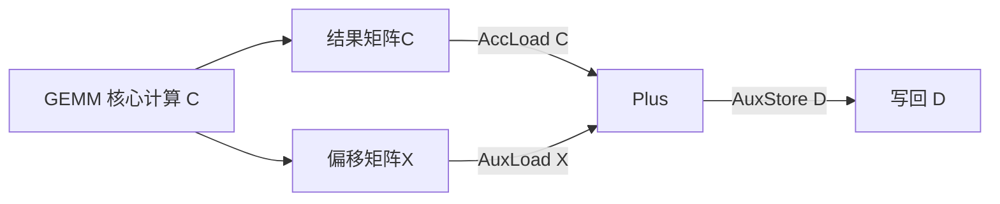

# EVG 快速开发指南

---
> **EVG（Epilogue Visitor Graph）** 是 Catlass 中用于 GEMM 后处理（Epilogue）的声明式框架，有助于加速Epilogue开发。本文以基于EVG的[`Matmul+Add`](../../examples/32_matmul_add_evg/README.md)算子开发为示例，助力您开启EVG的快速实践。

[TOC]

---

## `Matmul+Add`算子开发

> 您可参考样例代码：[32_matmul_add_evg](../../examples/32_matmul_add_evg/matmul_add_evg.cpp)

EVG使用"表达式"声明计算逻辑，例如`Matmul+Add`算子的计算式为`D = C + X`（其中C = A x B, 即A，B两矩阵的矩阵乘， X是偏移）。

在EVG中，使用模板节点定义并实现后处理过程，[`TreeVisitor`](../../include/catlass/epilogue/fusion/tree_visitor.hpp)是一种树状节点，`TreeVisitor`节点的"拼接"实现包括父节点及若干子节点，开发者可利用`Epilogue::Fusion`下预定义的数据、计算节点，也可进行嵌套以实现较为复杂的后处理逻辑。

`TreeVisitor`采用自下而上的组装逻辑，对于`Matmul+Add`算子，（计算结果）写入全局内存GM作为父节点，前步加法操作可视作子节点，而加法操作过程也可作为一个`TreeVisitor`节点：`Plus`计算作为父节点，从AIC上的累加器读取C矩阵、以及从GM上读入X矩阵这两个数据操作作为其子节点。`Matmul+Add`算子的后处理过程如下图所示，所涉及的计算节点内容包括：

 - 从GM读入数据：[`Epilogue::Fusion::VisitorAuxLoad`](../../include/catlass/epilogue/fusion/visitor_aux_load.hpp)
 - 从累加器中读出矩阵计算结果：[`Epilogue::Fusion::VisitorAccLoad`](../../include/catlass/epilogue/fusion/visitor_acc_load.hpp)
 - 进行逐元素加法计算：[`Epilogue::Fusion::VisitorCompute`](../../include/catlass/epilogue/fusion/visitor_compute.hpp)、[`Epilogue::Fusion::Plus`](../../include/catlass/epilogue/fusion/operations.hpp)
 - 将数据搬运回GM：[`Epilogue::Fusion::VisitorAuxStore`](../../include/catlass/epilogue/fusion/visitor_aux_store.hpp)



由此可以组装出一个完整的后处理模板：

<details>
<summary><strong>核心EVG组装</strong></summary>

*以下是`Matmul+Add`算子所需要的特化EVG构造过程*
```cpp
// ...
#include "catlass/gemm/kernel/matmul_epilogue.hpp"
#include "catlass/gemm/kernel/matmul_visitor.hpp"
#include "catlass/epilogue/fusion/fusion.hpp"

// ...
// 保持同样的Layout布局
using LayoutX = LayoutC;
using LayoutD = LayoutC;

using PlusVisitor = Epilogue::Fusion::TreeVisitor<
    Epilogue::Fusion::VisitorCompute<Epilogue::Fusion::Plus, half>,
    Epilogue::Fusion::VisitorAccLoad<half>,  // 加载 C (workspace)
    Epilogue::Fusion::VisitorAuxLoad<half, LayoutX>   // 加载 X
>;

using EVG = Catlass::Epilogue::Fusion::TreeVisitor<
    Epilogue::Fusion::VisitorAuxStore<half, LayoutD>,
    PlusVisitor>;
```
</details>


上述核心计算(加法操作)`Epilogue::Fusion::Plus`是对`AscendC::Add`的封装，EVG在使用时只需声明计算逻辑，无需关注搬运/事件/布局细节。

接下来，将组合后的`EVG`作为模板参数传递给`BlockEpilogue`，由于计算逻辑等已经封装在`EVG`内，所以在模板构造阶段只需补充传递`computeLength`即可。

```diff
- // examples/03_matmul_add/matmul_add.cpp
+ // examples/32_matmul_add_evg/matmul_add_evg.cpp

using CType = Gemm::GemmType<half, LayoutC>;

+ constexpr uint32_t computeLength = Epilogue::EpilogueAtlasA2Visitor::ArchTag::UB_SIZE /3/2/sizeof(half);
- using BlockEpilogue = Epilogue::Block::BlockEpilogue<EpilogueDispatchPolicy, CType, XType, DType, TileElemWiseEpilogue, EpilogueTileCopy>;
+ using BlockEpilogue = Epilogue::Block::BlockEpilogue<Epilogue::EpilogueAtlasA2Visitor, CType, tla::Int<computeLength>, EVG>;
```

 - 上述代码比较的是未使用EVG和使用EVG在构造`BlockEpilogue`上的区别（详见样例[`03_matmul_add`](../../examples/03_matmul_add/README.md)与[`32_matmul_add_evg`](../../examples/32_matmul_add_evg/README.md)）

最后，构造出`MatmulKernel`模板并实例化进行后续计算
```cpp
// 在NPU Device侧申请deviceD
// ...

// 准备 EVG Arguments
typename EVG::Arguments evg_args{
    {
        {},
        {deviceD, layoutD},     // Epilogue::Fusion::VisitorAuxLoad<half, LayoutX>
        {}
    },
    {deviceD, layoutD}          // Epilogue::Fusion::VisitorAuxStore<half, LayoutD>
};

// ...
using MatmulKernel = Gemm::Kernel::MatmulVisitor<BlockMmad, BlockEpilogue, BlockScheduler>;
typename MatmulKernel::Arguments arguments{options.problemShape, deviceA, deviceB, evg_args};
```

请注意以下两点：
 - 为便于EVG灵活组合使用，需提供`EVG::Arguments`的参数实例`evg_args`并组合进`arguments`中
 - 为匹配EVG使用，在Kernel层请使用[`Gemm::Kernel::MatmulVisitor`](../../include/catlass/gemm/kernel/matmul_visitor.hpp)


## 算子编译与执行

基于EVG实现的算子编译过程与CATLASS下其他样例算子一致，即在同级目录下创建[`CMakeLists.txt`](../../examples/32_matmul_add_evg/CMakeLists.txt)以关联该项目：
```cmake
catlass_example_add_executable(32_matmul_add_evg mix matmul_add_evg.cpp)
```

随后在主目录下执行下述指令编译出算子产物：
```bash
bash scripts/build.sh 32_matmul_add_evg
```

执行下述指令出现`Compare success.`表明该使用EVG实现的Matmul+Add算子精度测试成功。
```bash
cd output/bin
# 可执行文件名 |矩阵m轴|n轴|k轴|Device ID
./32_matmul_add_evg 256 512 1024 0
```

## 总结

通过上述简单实践，相信您发现EVG作为CATLASS中GEMM类算子后处理的声明式框架，开发过程更为敏捷、易于组合。下面是关于EVG的一些最为重要的特征：

 - 使用"表达式"声明计算逻辑
 - 采取`LOAD`、`COMPUTE`、`STORE`三阶段语义，配合双缓冲机制
 - 扩展性强，多计算链路时通过增添 `Visitor` 节点实现


如您希望进一步关于EVG的进阶内容，实现更为复杂的算子后处理，请参考下述链接：
 - [EVT样例：QuantMatmul实现](./quant_matmul_cases_tutorial.md)
 - [EVT样例：ReluMatmul实现](./matmul_add&add_relu_cases_tutorial.md)
 - [EVG简要设计文档](./evg.md)
 - [API参考](./evg.md)