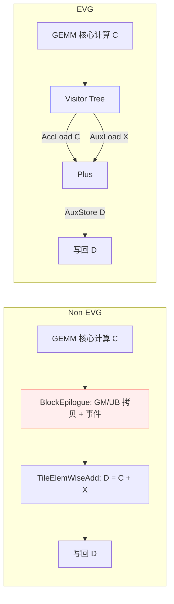

# Matmul+Add 案例对比：未使用 EVG vs 使用 EVG

## 简介

本文档以 `Matmul + Add` 为例，对比未使用 EVG 与使用 EVG 两种实现方式，展示EVG在开发便捷性与可扩展性上的优势，并进行性能的对比评估。

参考样例：
- 未使用 EVG：`examples/03_matmul_add/matmul_add.cpp`
- 使用 EVG：`examples/32_matmul_add_evg/matmul_add_evg.cpp`

相关实现要点：
- `include/catlass/epilogue/block/block_epilogue_elemwise_one_source.hpp`
- `include/catlass/epilogue/tile/tile_elemwise_add.hpp`
- `include/catlass/epilogue/fusion/operations.hpp` 中 `Plus`

## 背景与概念

- 未使用 EVG：需显式特化单源blockEpilogue模版，包含 GM→UB/UB→GM 拷贝、事件同步、以及逐元素计算（如 `TileElemWiseAdd`），需要开发者亲自组织访存与事件。
- 使用 EVG：通过 Visitor/Fusion 的描述式树形拼装`visitor节点`，由框架负责数据流、事件与计算算子串接，开发者以“表达式”方式声明 Epilogue。

## 结构图



## 基线样例（未使用 EVG）

要点：
- `TileElemWiseAdd` 完成逐元素加法；
- `BlockEpilogue` 负责 C/X/D 的 GM↔UB 搬运与事件编排；
- 调用端需要组合 `BlockMmad + BlockEpilogue + BlockScheduler` 并准备 workspace。

代表性片段：

```cpp
// include/catlass/epilogue/tile/tile_elemwise_add.hpp
// 逐元素加法：ubOut = ubIn0 + ubIn1
AscendC::Add(ubOut, ubIn0, ubIn1, COMPUTE_LENGTH);
```

```cpp
// include/catlass/epilogue/block/block_epilogue_elemwise_one_source.hpp
// 复制 C/X 到 UB，计算 D，再写回 D（含事件同步）
copyGmToUbC(ubC, gmSubblockC, layoutComputeInUb, layoutSubblockC);
copyGmToUbX(ubX, gmSubblockX, layoutComputeInUb, layoutSubblockX);
tileEpilogue(ubD, ubC, ubX);
copyUbToGmD(gmSubblockD, ubD, layoutSubblockD, layoutComputeInUb);
```

```cpp
// examples/03_matmul_add/matmul_add.cpp（选摘）
constexpr uint32_t computeLength = 16384;
using TileElemWiseEpilogue = Epilogue::Tile::TileElemWiseAdd<ArchTag, ComputeType, computeLength>;
using BlockEpilogue = Epilogue::Block::BlockEpilogue<
  EpilogueDispatchPolicy, CType, XType, DType, TileElemWiseEpilogue, EpilogueTileCopy>;
using MatmulKernel = Gemm::Kernel::MatmulEpilogue<BlockMmad, BlockEpilogue, BlockScheduler>;
```

开发负担：需要显式处理 UB 容量、事件旗标、子块布局、GM 偏移等细节；当算子链路变复杂（Add+Bias+Act+...）时组合与调度复杂度提升明显。

## EVG 样例（使用 EVG）

要点：
- 以 Visitor/Fusion 方式描述 D = C + X：`AccLoad(C) + AuxLoad(X)` → `Plus` → `AuxStore(D)`；
- `Plus` 的实现依旧是底层 `AscendC::Add`，但数据流/事件由框架拼装完成；
- 调用端以 `MatmulVisitor` 接入，无需直接管理 UB/事件细节。

代表性片段：

```cpp
// include/catlass/epilogue/fusion/operations.hpp (64-76)
// Plus：底层仍调用 AscendC::Add
AscendC::Add(dst, src0, src1, compute_length);
```

```cpp
// examples/32_matmul_add_evg/matmul_add_evg.cpp（选摘）
constexpr uint32_t computeLength = Epilogue::EpilogueAtlasA2Visitor::ArchTag::UB_SIZE /3/2/sizeof(half); //16384
using EVG = Epilogue::Fusion::TreeVisitor<
  Epilogue::Fusion::VisitorAuxStore<half, LayoutD>,
  Epilogue::Fusion::TreeVisitor<
    Epilogue::Fusion::VisitorCompute<Epilogue::Fusion::Plus, half>,
    Epilogue::Fusion::VisitorAccLoad<half>,
    Epilogue::Fusion::VisitorAuxLoad<half, LayoutX>
  >>;
using BlockEpilogue = Epilogue::Block::BlockEpilogue<
  Epilogue::EpilogueAtlasA2Visitor, CType, tla::Int<computeLength>, EVG>;
using MatmulKernel = Gemm::Kernel::MatmulVisitor<BlockMmad, BlockEpilogue, BlockScheduler>;
```

开发便捷性：通过“表达式式”树结构声明计算逻辑，减少手写搬运/事件/布局逻辑；当扩展为多算子链路时，仅需增添 Visitor 节点，无需重写调度细节。

## 差异总结（开发便捷性）

- 非 EVG：手工组织 GM/UB 拷贝、事件等待/置位、UB 布局、块/子块切分；修改算子链路需要同步修改调度细节。
- EVG：以 Visitor Tree 声明式拼装，框架负责数据流与事件；易于扩展与维护，可复用算子节点（如 `Plus`、`Mul`、`Activation`）。

## 性能对比

从小到大随机生成交替是否对齐32的shapes，使用msprof op进行采集，OpBasicInfo的Task Duration(us)
表格：

| m     | n     | k     | Task Duration(us) | EVG Task Duration(us) | speedup     |
|-------|-------|-------|-------------------|-------------------|-------------|
| 87    | 198   | 120   | 19.540001         | 20.059999         | 0.974077865 |
| 192   | 160   | 128   | 16.34             | 16.959999         | 0.963443453 |
| 1696  | 1632  | 1024  | 84.839996         | 85.059998         | 0.997413567 |
| 3731  | 5062  | 312   | 320.519989        | 318.23999         | 1.007164401 |
| 2157  | 2191  | 1612  | 297.5             | 293.179993        | 1.014734999 |
| 5568  | 4416  | 320   | 192.179993        | 192.360001        | 0.999064213 |
| 1148  | 2502  | 3074  | 351.420013        | 353.040009        | 0.995411296 |
| 4160  | 2304  | 1152  | 115.120003        | 114.019997        | 1.009647483 |
| 4478  | 583   | 7644  | 711.26001         | 715.280029        | 0.994379797 |
| 1184  | 2528  | 6816  | 581.460022        | 578.119995        | 1.005777394 |
| 4433  | 2106  | 2274  | 640.679993        | 642.619995        | 0.996981105 |
| 1343  | 15803 | 2209  | 1364.5            | 1356.560059       | 1.005852996 |
| 4736  | 2368  | 4288  | 706.900024        | 711.419983        | 0.993646567 |
| 3392  | 4640  | 5600  | 2093.060059       | 2097.800049       | 0.997740495 |
| 4414  | 4695  | 4735  | 2616.879883       | 2591.580078       | 1.009762309 |
| 5632  | 2144  | 13024 | 3386.080078       | 3407.539795       | 0.993702284 |
| 11569 | 6036  | 8288  | 14074.85938       | 13935.2002        | 1.010022043 |
| 5472  | 7680  | 15488 | 5633.919922       | 5603.879883       | 1.005360579 |
| 7232  | 15296 | 15200 | 28441.37891       | 28615.33984       | 0.99392071  |
| 12824 | 10410 | 16264 | 66648.10156       | 66860.05469       | 0.996829899 |
|       |       |       |                   |                   | 0.998246673 |

# matmul add relu(D=relu(A*B+X))

类似的，可以在matmul+add的基础上，通过

non-EVG
```cpp
// include/catlass/epilogue/tile/tile_elemwise_add_relu.hpp
AscendC::Add(ubOut, ubIn0, ubIn1, COMPUTE_LENGTH);
AscendC::Relu(ubOut, ubOut, COMPUTE_LENGTH);
```
EVG
```cpp
// 加法操作符
template <typename T>
struct PlusRelu {
    CATLASS_DEVICE
    void operator()(
        AscendC::LocalTensor<T>& dst,
        AscendC::LocalTensor<T> const& src0,
        AscendC::LocalTensor<T> const& src1,
        uint32_t compute_length
    ) const {
        AscendC::Add(dst, src0, src1, compute_length);
        AscendC::Relu(dst, dst, compute_length);
    }
};
```
实现D=relu(A*B+X)。

## 性能对比

从小到大随机生成交替是否对齐32的shapes，使用msprof op进行采集，OpBasicInfo的Task Duration(us)
表格：

| m     | n     | k     | Task Duration(us) | EVG Task Duration(us) | speedup     |
|-------|-------|-------|-------------------|-----------------------|-------------|
| 87    | 198   | 120   | 21.280001         | 20.700001             | 1.028019322 |
| 192   | 160   | 128   | 16.799999         | 17.360001             | 0.967741822 |
| 1696  | 1632  | 1024  | 85.260002         | 83.800003             | 1.017422422 |
| 3731  | 5062  | 312   | 318.980011        | 320.23999             | 0.996065516 |
| 2157  | 2191  | 1612  | 288.959991        | 294.720001            | 0.980455992 |
| 5568  | 4416  | 320   | 192.119995        | 194.940002            | 0.985533975 |
| 1148  | 2502  | 3074  | 355.359985        | 364.519989            | 0.974871052 |
| 4160  | 2304  | 1152  | 115.199997        | 114.660004            | 1.004709515 |
| 4478  | 583   | 7644  | 717.140015        | 717.73999             | 0.999164078 |
| 1184  | 2528  | 6816  | 576.539978        | 569.619995            | 1.01214842  |
| 4433  | 2106  | 2274  | 641.119995        | 644.659973            | 0.994508767 |
| 1343  | 15803 | 2209  | 1359.319946       | 1368.319946           | 0.993422591 |
| 4736  | 2368  | 4288  | 708.900024        | 710.539978            | 0.997691961 |
| 3392  | 4640  | 5600  | 2078.899902       | 2104.340088           | 0.987910611 |
| 4414  | 4695  | 4735  | 2568.320068       | 2591.959961           | 0.99087953  |
| 5632  | 2144  | 13024 | 3354.019775       | 3352.439941           | 1.000471249 |
| 11569 | 6036  | 8288  | 13968.54004       | 14097.2002            | 0.990873354 |
| 5472  | 7680  | 15488 | 5640.640137       | 5640.799805           | 0.999971694 |
| 7232  | 15296 | 15200 | 28661.38086       | 28620.35938           | 1.001433297 |
| 12824 | 10410 | 16264 | 67052.21875       | 66978.79688           | 1.001096196 |
|       |       |       |                   |                       | 0.996219568 |