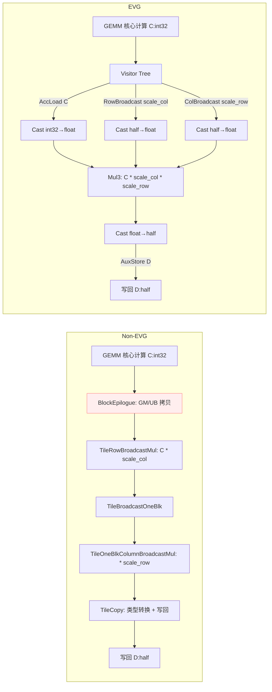

# QuantMatmul 案例对比：未使用 EVG vs 使用 EVG

## 简介

本文档以量化矩阵乘法（QuantMatmul）为例，对比未使用 EVG 与使用 EVG 两种实现方式，展示EVG在开发便捷性与可扩展性上的优势，并进行性能的对比评估。

计算流程：`D = half(float(int32_t C) * scale_col * scale_row)`，其中 `C = A * B`（A、B 为 int8_t，C 为 int32_t 累加结果），`scale_col` 为列向量（形状 {1, n}），`scale_row` 为行向量（形状 {m, 1}）。

参考样例：
- 未使用 EVG：`examples/12_quant_matmul/quant_matmul.cpp`
- 使用 EVG：`examples/12_quant_matmul_evg/quant_matmul_evg.cpp`

相关实现要点：
- `include/catlass/epilogue/tile/tile_broadcast_mul.hpp` 中 `TileRowBroadcastMul`、`TileOneBlkColumnBroadcastMul`
- `include/catlass/epilogue/tile/tile_broadcast_one_blk.hpp` 中 `TileBroadcastOneBlk`
- `include/catlass/epilogue/fusion/visitor_row_broadcast.hpp` 中 `VisitorRowBroadcast`
- `include/catlass/epilogue/fusion/visitor_col_broadcast.hpp` 中 `VisitorColBroadcast`
- `include/catlass/epilogue/fusion/operations.hpp` 中 `Mul3`
- `include/catlass/epilogue/block/block_epilogue_per_token_dequant.hpp`
- `include/catlass/gemm/kernel/quant_matmul_multistage_workspace.hpp.hpp`

## 背景与概念

- 未使用 EVG：需显式组合多个 Tile 操作，包括 `TileRowBroadcastMul`（行广播 scale_col）、`TileBroadcastOneBlk`（单块广播）、`TileOneBlkColumnBroadcastMul`（列广播 scale_row）、`TileCopy`（类型转换与写回），需要开发者在block内部（block_epilogue_per_token_dequant）亲自组织 GM→UB/UB→GM 拷贝、事件同步、以及类型转换与广播计算。
- 使用 EVG：通过 Visitor/Fusion 的描述式树形拼装 `visitor节点`，由框架负责数据流、事件与计算算子串接，开发者以“表达式”方式声明 Epilogue，通过 `VisitorRowBroadcast`、`VisitorColBroadcast`、`VisitorCompute<Mul3>` 等节点描述广播和三元乘法操作。

## 结构图



## 基线样例（未使用 EVG）

要点：
- `TileRowBroadcastMul` 完成行广播乘法（将 {1, n} 的 scale_col 广播到 {m, n} 并与 C 相乘）；
- `TileBroadcastOneBlk` 完成单块广播，用于中间结果的布局转换；
- `TileOneBlkColumnBroadcastMul` 完成列广播乘法（将 {m, 1} 的 scale_row 广播到 {m, n} 并相乘）；
- `TileCopy` 负责类型转换（float→half）和写回；
- `BlockEpilogue` 负责 C/Scale/PerTokenScale/D 的 GM↔UB 搬运、事件编排与多个 Tile 操作的串接；
- 调用端需要组合 `BlockMmad + BlockEpilogue + BlockScheduler` 并准备 workspace。

代表性片段：

```cpp
// include/catlass/epilogue/tile/tile_broadcast_mul.hpp
// TileRowBroadcastMul：行广播乘法，将 {1, n} 广播到 {m, n}
AscendC::Mul(
    ubOut[rowOffset * TileShape::COLUMN + colOffset],
    ubIn0[rowOffset * TileShape::COLUMN + colOffset],
    ubIn1[colOffset],
    mask, repeatTimes, repeatParams
);
```

```cpp
// include/catlass/epilogue/tile/tile_broadcast_mul.hpp
// TileOneBlkColumnBroadcastMul：列广播乘法，将 {m, 1} 广播到 {m, n}
AscendC::Mul(
    ubOut[rowOffset * TileShape::COLUMN + colOffset],
    ubIn0[rowOffset * TileShape::COLUMN + colOffset],
    ubIn1[rowOffset * eleNumPerBlk],
    mask, repeatTimes, repeatParams
);
```

```cpp
// include/catlass/epilogue/block/block_epilogue_per_token_dequant.hpp
AscendC::WaitFlag<AscendC::HardEvent::MTE2_V>(eventUbScaleMTE2VList[ubListId]);
tileRowBroadcastMul(ubMul, ubCFp32, ubScale);
AscendC::SetFlag<AscendC::HardEvent::V_MTE2>(eventUbScaleVMTE2List[ubListId]);

AscendC::WaitFlag<AscendC::HardEvent::MTE2_V>(eventUbPerTokenScaleMTE2VList[ubListId]);
tileBroadcastOneBlk(ubPerTokenScaleBrcb, ubPerTokenScale);
AscendC::SetFlag<AscendC::HardEvent::V_MTE2>(eventUbPerTokenScaleVMTE2List[ubListId]);

AscendC::PipeBarrier<PIPE_V>();
tileOneBlkColumnBroadcastMul(ubPerTokenMul, ubMul, ubPerTokenScaleBrcb);
AscendC::PipeBarrier<PIPE_V>();
```

```cpp
// examples/12_quant_matmul/quant_matmul.cpp（选摘）
using EpilogueTileShape = MatrixShape<32, 256>;
using TileRowBroadcastMul = Epilogue::Tile::TileRowBroadcastMul<ArchTag, RowBroadcastMulType, EpilogueTileShape>;
using TileBroadcastOneBlk =
    Epilogue::Tile::TileBroadcastOneBlk<ArchTag, BroadcastOneBlkType, EpilogueTileShape::ROW>;
using TileOneBlkColumnBroadcastMul =
    Epilogue::Tile::TileOneBlkColumnBroadcastMul<ArchTag, OneBlkColumnBroadcastMulType, EpilogueTileShape>;
using TileCopy = Epilogue::Tile::TileCopy<ArchTag, CType, ScaleType, PerTokenScaleType, DType>;
using TileScheduler = Epilogue::Tile::EpilogueHorizontalTileSwizzle;

using BlockEpilogue = Epilogue::Block::BlockEpilogue<
    EpilogueDispatchPolicy, CType, ScaleType, PerTokenScaleType, DType,
    TileRowBroadcastMul, TileBroadcastOneBlk, TileOneBlkColumnBroadcastMul, TileCopy, TileScheduler>;
using MatmulKernel = Gemm::Kernel::QuantMatmulMultiStageWorkspace<BlockMmad, BlockEpilogue, BlockScheduler, workspaceStages>;
```

开发负担：需要显式处理 UB 容量、事件旗标、子块布局、GM 偏移等细节；需要协调多个 Tile 操作的执行顺序和中间结果存储；当算子链路变复杂时需要手动管理更多中间状态和类型转换。

## EVG 样例（使用 EVG）

要点：
- 以 Visitor/Fusion 方式描述 `D = half(float(C) * scale_col * scale_row)`：通过 `VisitorAccLoad<int32_t>` 加载累加器 C，通过 `VisitorCast<float, int32_t>` 转换为 float；通过 `VisitorRowBroadcast` 加载并广播 scale_col（{1, n} → {m, n}），通过 `VisitorCast<float, half>` 转换为 float；通过 `VisitorColBroadcast` 加载并广播 scale_row（{m, 1} → {m, n}），通过 `VisitorCast<float, half>` 转换为 float；通过 `VisitorCompute<Mul3, float>` 执行三元乘法；通过 `VisitorCast<half, float>` 转换回 half；最后通过 `VisitorAuxStore<half>` 写回 D；
- `Mul3` 的实现依旧是底层 `AscendC::Mul`（两次调用），但数据流/事件由框架拼装完成；
- 调用端对齐 `matmul_multistage_workspace_visitor` 接入，直接复用block层，无需直接管理 UB/事件/类型转换细节。

代表性片段：

```cpp
// include/catlass/epilogue/fusion/operations.hpp (92-107)
// Mul3：三元乘法，执行 dst = src0 * src1 * src2
template <typename T>
struct Mul3 {
    CATLASS_DEVICE
    void operator()(
        AscendC::LocalTensor<T>& dst,
        AscendC::LocalTensor<T> const& src0,
        AscendC::LocalTensor<T> const& src1,
        AscendC::LocalTensor<T> const& src2,
        uint32_t compute_length
    ) const {
        AscendC::Mul(dst, src0, src1, compute_length);
        AscendC::PipeBarrier<PIPE_V>();
        AscendC::Mul(dst, dst, src2, compute_length);
    }
};
```

```cpp
// examples/12_quant_matmul_evg/quant_matmul_evg.cpp（选摘）
// EVG: D = half( float(C) * scale_col * scale_row )
constexpr uint32_t computeLength = 3072; //12*256
using EVG = Epilogue::Fusion::TreeVisitor<
    Epilogue::Fusion::VisitorAuxStore<half, layout::RowMajor>,
    Epilogue::Fusion::TreeVisitor<
        Epilogue::Fusion::VisitorCast<half, float>,
        Epilogue::Fusion::TreeVisitor<
            Epilogue::Fusion::VisitorCompute<Epilogue::Fusion::Mul3, float>,
            Epilogue::Fusion::TreeVisitor<
                Epilogue::Fusion::VisitorCast<float, int32_t>,
                Epilogue::Fusion::VisitorAccLoad<int32_t>
            >,
            Epilogue::Fusion::TreeVisitor<
                Epilogue::Fusion::VisitorCast<float, half>,
                Epilogue::Fusion::VisitorRowBroadcast<half, layout::RowMajor>
            >,
            Epilogue::Fusion::TreeVisitor<
                Epilogue::Fusion::VisitorCast<float, half>,
                Epilogue::Fusion::VisitorColBroadcast<half, layout::RowMajor>
            >
        >
    >
>;

typename EVG::Arguments evg_args{
        {
            {
                {
                    {},
                    {}
                },
                {
                    {deviceScale, {1, n}},
                    {}
                },
                {
                    {devicePerTokenScale, {m, 1}},
                    {}
                },
                {}
            },
            {}
        },
        {deviceD, layoutD}
    };

using BlockEpilogue = Epilogue::Block::BlockEpilogue<
    Epilogue::EpilogueAtlasA2PreloadAsyncVisitor, CType, tla::Int<computeLength>, EVG>;
using MatmulKernel = Gemm::Kernel::MatmulVisitor<BlockMmad, BlockEpilogue, BlockScheduler>;
```

开发便捷性：通过“表达式式”树结构声明计算逻辑（包含类型转换、广播、三元乘法），减少手写搬运/事件/布局逻辑；当扩展为多算子链路时，仅需增添 Visitor 节点（如添加激活函数、Bias 等），无需重写调度细节；类型转换通过 `VisitorCast` 节点自动处理，无需显式管理中间类型。

## 差异总结（开发便捷性）

- 非 EVG：手工组织 GM/UB 拷贝、事件等待/置位、UB 布局、块/子块切分；需要显式组合多个 Tile 操作（TileRowBroadcastMul、TileBroadcastOneBlk、TileOneBlkColumnBroadcastMul、TileCopy）并管理执行顺序；需要手动处理类型转换和中间结果存储；修改算子链路需要同步修改调度细节。
- EVG：以 Visitor Tree 声明式拼装，框架负责数据流与事件；通过 `VisitorRowBroadcast`、`VisitorColBroadcast` 自动处理广播逻辑；通过 `VisitorCast` 自动处理类型转换；通过 `VisitorCompute<Mul3>` 简洁表达三元乘法；易于扩展与维护，可复用算子节点（如 `Mul3`、`Plus`、`Mul`）。

## 性能对比

从小到大随机生成交替是否对齐32的shapes，附加一些较为对齐的shapes，使用msprof op进行采集，OpBasicInfo的Task Duration(us)
表格：

| m     | n     | k     | Task Duration(us) | EVG Task Duration(us) | speedup     |
|-------|-------|-------|-------------------|-----------------------|-------------|
| 87    | 198   | 120   | 17.879999         | 17.42                 | 1.026406372 |
| 192   | 160   | 128   | 14.38             | 12.36                 | 1.163430421 |
| 1696  | 1632  | 1024  | 34.720001         | 34.419998             | 1.008715951 |
| 3731  | 5062  | 312   | 216.220001        | 230.520004            | 0.937966325 |
| 2157  | 2191  | 1612  | 122.220001        | 119.400002            | 1.023618082 |
| 5568  | 4416  | 320   | 194.800003        | 212.240005            | 0.917828865 |
| 1148  | 2502  | 3074  | 129.940002        | 131.139999            | 0.990849497 |
| 4160  | 2304  | 1152  | 102.599998        | 106.279999            | 0.965374473 |
| 4478  | 583   | 7644  | 309.160004        | 309.660004            | 0.998385326 |
| 1184  | 2528  | 6816  | 265.23999         | 263.959991            | 1.004849216 |
| 4433  | 2106  | 2274  | 296.660004        | 296.600006            | 1.000202286 |
| 1343  | 15803 | 2209  | 619.340027        | 622.179993            | 0.995435459 |
| 4736  | 2368  | 4288  | 513.780029        | 518.940002            | 0.990056706 |
| 3392  | 4640  | 5600  | 959.5             | 954.280029            | 1.005470062 |
| 4414  | 4695  | 4735  | 1161.040039       | 1163.540039           | 0.997851385 |
| 5632  | 2144  | 13024 | 1732.380005       | 1728.199951           | 1.002418733 |
| 11569 | 6036  | 8288  | 6009.859863       | 6052.720215           | 0.992918828 |
| 5472  | 7680  | 15488 | 4094.159912       | 4071.100098           | 1.005664271 |
| 7232  | 15296 | 15200 | 18419.45898       | 18342.17969           | 1.004213201 |
| 12824 | 10410 | 16264 | 28259.47852       | 28113.35938           | 1.005197498 |
| 32    | 32    | 32    | 9.4               | 10.7                  | 0.878504673 |
| 64    | 64    | 64    | 10.1              | 11.5                  | 0.87826087  |
| 128   | 128   | 128   | 11.34             | 11.66                 | 0.972555746 |
| 256   | 256   | 256   | 13.66             | 14.62                 | 0.934336525 |
| 512   | 512   | 512   | 17.940001         | 18.34                 | 0.978189804 |
| 1024  | 1024  | 1024  | 23.139999         | 23.799999             | 0.972268906 |
| 2048  | 2048  | 2048  | 55.16             | 54.700001             | 1.008409488 |
| 3072  | 3072  | 3072  | 134.119995        | 136.759995            | 0.980696109 |
| 4096  | 4096  | 4096  | 282.640015        | 283.019989            | 0.998657431 |
| 5120  | 5120  | 5120  | 526.47998         | 525.820007            | 1.001255131 |
| 6144  | 6144  | 6144  | 881.840027        | 881.580017            | 1.000294936 |
| 7168  | 7168  | 7168  | 1379.540039       | 1379.540039           | 1           |
| 8192  | 8192  | 8192  | 2062.219971       | 2056.399902           | 1.002830222 |
| 9216  | 9216  | 9216  | 2899.020264       | 2892.499756           | 1.002254281 |
| 10240 | 10240 | 10240 | 3984.300049       | 3986.140137           | 0.999538378 |
| 11264 | 11264 | 11264 | 5303.240234       | 5303.560059           | 0.999939696 |
| 12288 | 12288 | 12288 | 6882.119629       | 6878.300293           | 1.000555273 |
| 13312 | 13312 | 13312 | 9027              | 9019.05957            | 1.000880406 |
| 14336 | 14336 | 14336 | 11138.83984       | 11194.40039           | 0.995036755 |
| 15360 | 15360 | 15360 | 14015.95996       | 14046.36035           | 0.99783571  |
| 16384 | 16384 | 16384 | 17432             | 17387.08008           | 1.002583523 |
| 17408 | 17408 | 17408 | 20712.54102       | 20770.48047           | 0.99721049  |
| 18432 | 18432 | 18432 | 24604.38086       | 24722.33984           | 0.995228648 |
|       |       |       |                   |                       | 0.991492464 |
