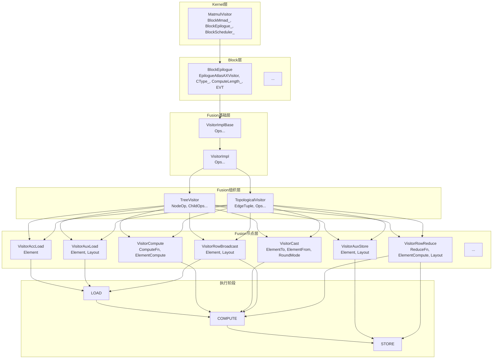
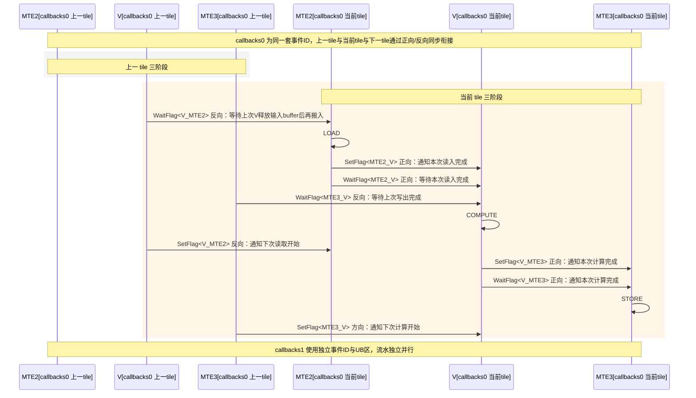
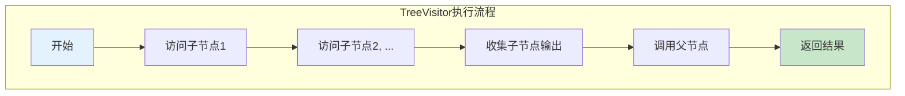
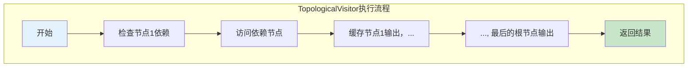
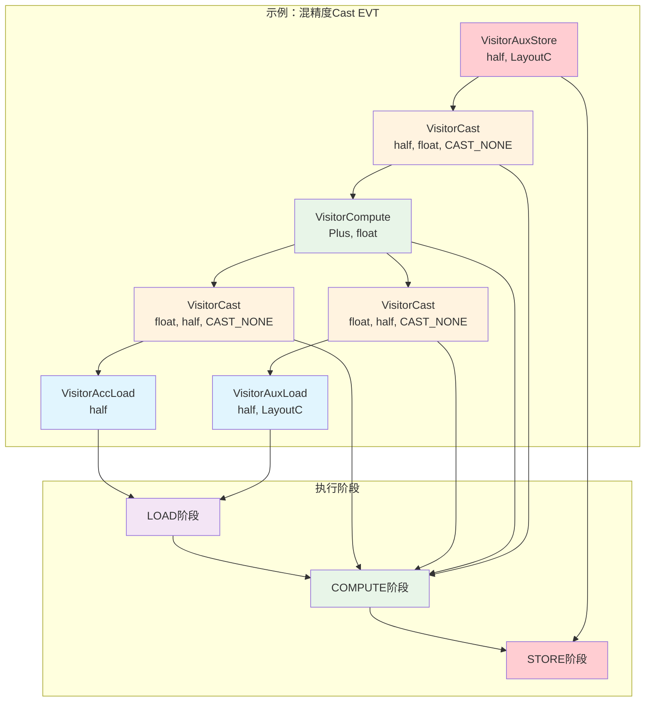

# Catlass Epilogue Visitor Tree 设计文档

## 1. 简介

### 背景
Catlass是面向AscendC的模板库，对标CUTLASS语义，为NPU提供高效的矩阵运算能力。在GEMM（General Matrix Multiply）运算中，Epilogue阶段负责对矩阵乘法结果进行后处理，将后处理操作抽象为模板节点的任意拼接，实现灵活的组合与复用。

### 核心挑战
- **算子多样性**：Epilogue算子种类繁多（加法、类型转换、行广播、行规约等），需要统一组织与复用机制。
- **UB空间受限**：AscendC的Unified Buffer空间有限，需精细管理UB分配与流水，避免空间浪费。
- **并发同步复杂**：MTE2/MTE3与V流水线并发执行，事件同步方向易错，需要清晰的同步语义。
- **组合复杂性**：不同应用场景需要不同的算子组合，需要支持任意拼接与嵌套。

### Catlass应对策略

#### 1. 模板节点任意拼接
- **TreeVisitor**：支持树形结构的节点组合，父节点可以依赖多个子节点
- **TopologicalVisitor**：支持DAG拓扑结构，允许节点复用，如`(C+X)+(C+X)`
- **嵌套组合**：支持任意深度的嵌套组合，如`cast<float>(cast<half>(C) + cast<half>(X))`

#### 2. 统一的三阶段语义
- **LOAD阶段**：数据从GM加载到UB，包括AccLoad、AuxLoad、RowBroadcast等
- **COMPUTE阶段**：在UB中进行计算，包括Compute、Cast等操作
- **STORE阶段**：将结果写回GM，包括AuxStore、RowReduce等

#### 3. 智能资源管理
- **UB自动分配**：根据节点类型和计算长度自动分配UB空间
- **双缓冲流水**：通过事件同步实现数据搬运与计算完全并行
- **类型安全**：通过模板参数确保类型安全，支持混合精度计算

#### 4. 灵活的复用机制
- **节点缓存**：TopologicalVisitor支持节点输出缓存，避免重复计算
- **参数复用**：支持同一节点在不同位置使用不同参数
- **模板特化**：针对不同硬件特性进行模板特化优化

## 2. 系统设计方案概述

### 架构示意图

#### 图1：分层 + 节点族 + 阶段映射




### API表

| API Level | Class Template | Features |
|-----------|----------------|----------|
| Kernel | `Gemm::Kernel::MatmulVisitor<BlockMmad_, BlockEpilogue_, BlockScheduler_>` | EVT入参桥接、Workspace组织 |
| Block | `Epilogue::Block::BlockEpilogue<EpilogueAtlasA2Visitor, CType_, ComputeLength_, EVT>` | Tile划分、双缓冲、事件同步 |
| Fusion Base | `Epilogue::Fusion::VisitorImplBase<Ops...>` | Arguments/Params汇聚、workspace计量、can_implement校验 |
| Fusion Impl | `Epilogue::Fusion::VisitorImpl<Ops...>` | 节点规范、get_callbacks统一构建、Callbacks生命周期钩子 |
| Tree Visitor | `Epilogue::Fusion::TreeVisitor<NodeOp, ChildOps...>` | 树形模板，父后子先遍历，按阶段传递子输出 |
| Topological Visitor | `Epilogue::Fusion::TopologicalVisitor<EdgeTuple, Ops...>` | DAG拓扑复用与节点缓存，根节点驱动全图 |
| Compute | `Epilogue::Fusion::VisitorCompute<ComputeFn, ElementCompute>` | 逐元素算子（如Plus/Maximum/Minimum） |
| Cast | `Epilogue::Fusion::VisitorCast<ElementTo, ElementFrom, RoundMode>` | 类型转换（含RoundMode） |
| Acc Load | `Epilogue::Fusion::VisitorAccLoad<Element>` | 从GEMM Block块工作区块按局部坐标Load |
| Aux Load | `Epilogue::Fusion::VisitorAuxLoad<Element, Layout>` | 从用户GM按全局坐标Load |
| Aux Store | `Epilogue::Fusion::VisitorAuxStore<Element, Layout>` | 写回用户GM（STORE阶段） |
| Row Broadcast | `Epilogue::Fusion::VisitorRowBroadcast<Element, Layout>` | 1xN行向量广播到MxN tile |
| Row Reduce | `Epilogue::Fusion::VisitorRowReduce<ComputeFn, ElementCompute, Layout>` | 按行规约到1xN并原子加到GM |

### 2.1 多层级API（Kernel）

`MatmulVisitor`参数处理：
- `Arguments`→`Params`：将用户参数转换为内部参数
- `evt_args`→Fusion::Params：EVT参数桥接到Fusion层
- Workspace切分与`BlockEpilogue`衔接

#### 自然语言流程（Kernel）
- 用户以 EVT 定义后处理，并构造 `EVT::Arguments`；
- Kernel 将 `problemShape, ptrA, ptrB, evt_args` 打包为 `MatmulVisitor::Arguments`；
- 计算 `GetWorkspaceSize`（= GEMM 的 C 工作区 + EVT 的 workspace 对齐和）；
- 调用 `ToUnderlyingArguments`：先组织 A/B/C 的布局与 workspace，再用 `EVT::to_underlying_arguments` 生成 Fusion 层 `Params`；
- AIC 完成 GEMM 并写入 C(workspace)；AIV 等待跨核 flag 后执行 BlockEpilogue（见 2.2）。

#### 关键代码（Kernel）
```cpp
// 关键代码片段
typename MatmulKernel::Arguments arguments{options.problemShape, deviceA, deviceB, evt_args};
typename BlockEpilogue::EVT::Params fusion_params = 
    BlockEpilogue::EVT::to_underlying_arguments(
        problemShape, args.evt_args, 
        workspace + sizeof(ElementC) * m * n
    );
```

### 2.2 多层级API（Block）

#### 图2：双缓冲六流水（callbacks0 上一 tile 三条 + 当前 tile 三条），同步关系（按生产/消费语义）



`BlockEpilogue`核心逻辑：
- 子块划分：按`COMPUTE_LENGTH`进行行列分块
- 双缓冲轮转：`ubListId`交替使用两套callbacks
- 事件同步：`V_MTE2/MTE2_V/MTE3_V/V_MTE3`的Wait/Set顺序
- 统一`run_tile`调用LOAD/COMPUTE/STORE阶段

#### 自然语言流程（Block）
- 构造 `BlockEpilogue(resource, {evt_params})` 时，分配事件ID并设置初始 flag（允许 MTE2 搬入与 V 写出）；
- 子块划分：将 Block C 的实际形状按子核维度拆成子块；
- 为双缓冲分配两套 `Callbacks`：通过 `evt.get_callbacks(resource, ub_offset, COMPUTE_LENGTH, ...)` 申请 UB 片段，并构建各 Visitor 回调；
- 进入 tile 循环：交替选择 callbacks0/1，按事件次序发起三阶段：
  - LOAD：Wait V_MTE2 → visit(..., LOAD) → Set MTE2_V；
  - COMPUTE：Wait MTE2_V & MTE3_V → visit(..., COMPUTE) → Set V_MTE2 & V_MTE3；
  - STORE：Wait V_MTE3 → visit(..., STORE) → Set MTE3_V；
- 轮转下一个 buffer，形成搬入/计算/搬出并行的流水。

#### 关键代码（Block）
```cpp
// 关键代码片段
for (uint32_t r = 0; r < rows; ) {
    auto& cbs = ((ubListId & 1) ? callbacks1 : callbacks0);
    run_tile(cbs, globalTileOffset, localTileOffset, tileShape, calCount, ubListId);
    ubListId = 1 - ubListId; // Buffer 轮转
}
```

### 2.3 多层级API（Fusion）

#### 图3：TreeVisitor vs TopologicalVisitor 执行流程对比




- 以 TreeVisitor/TopologicalVisitor 描述计算图；
- 按树的父子关系嵌套，或以 `Edges` 指定拓扑；
- 根据各 Visitor 的 `Arguments` 顺序构造 `EVT::Arguments`；
- 典型最小示例（C+X 写 D）：
```cpp
using EVT = Epilogue::Fusion::TreeVisitor<
  Epilogue::Fusion::VisitorAuxStore<half, LayoutC>,
  Epilogue::Fusion::TreeVisitor<
    Epilogue::Fusion::VisitorCompute<Epilogue::Fusion::Plus, half>,
    Epilogue::Fusion::VisitorAccLoad<half>,
    Epilogue::Fusion::VisitorAuxLoad<half, LayoutC>
  >>;
typename EVT::Arguments evt_args{{{}, {deviceX, layoutD}, {}}, {deviceD, layoutD}};
```

#### Arguments API说明

| Visitor类型 | Arguments结构 | 参数说明 |
|-------------|---------------|----------|
| `VisitorAccLoad` | `Arguments{}` | 无参数，从GEMM工作区块加载 |
| `VisitorAuxLoad` | `Arguments{ptr_aux, layout}` | 需要GM地址和布局 |
| `VisitorAuxStore` | `Arguments{ptr_aux, layout}` | 需要GM地址和布局 |
| `VisitorCompute` | `Arguments{}` | 无参数，纯计算操作 |
| `VisitorCast` | `Arguments{}` | 无参数，类型转换 |
| `VisitorRowBroadcast` | `Arguments{ptr_row, layout}` | 需要行向量地址和布局 |
| `VisitorRowReduce` | `Arguments{ptr_row_out, layout, identity}` | 需要输出地址、布局和初始值；原子由ReduceFn确定 |

#### 1) `visitor_impl_base`
- `Arguments/Params`汇聚：统一参数管理
- workspace计量：16字节对齐的workspace计算
- `can_implement`一致性校验：确保所有节点可执行

#### 2) `visitor_impl`
- 节点规范：统一的`get_callbacks`接口
- `Callbacks`生命周期钩子：`begin_epilogue`/`end_epilogue`

#### 3) `tree_visitor`
- 树形模板：父后子先遍历
- 按阶段传递子输出：收集子节点输出传给父节点

组合逻辑与 Arguments 顺序：
- 模板形态：`TreeVisitor<ParentOp, ChildOp1, ChildOp2, ...>`
- 参数顺序：`typename EVT::Arguments{ (ChildOp1::Arguments, ChildOp2::Arguments, ...), ParentOp::Arguments }`
- 父节点（ParentOp）的 Arguments 总是最后写；这与模板形态“父在前”相反，便于按“先子后父”的执行顺序打包参数。
注意：TreeVisitor 的 Arguments 书写顺序与模板声明相反——父节点的 Arguments 永远写在该层最后（先写所有子节点的 Arguments，再写父节点）。
- 示例：
```cpp
// (C + X) 写回 D（父最后写）
using EVT = TreeVisitor<
  VisitorAuxStore<half, LayoutC>,
  TreeVisitor<VisitorCompute<Plus, half>, VisitorAccLoad<half>, VisitorAuxLoad<half, LayoutC>>
>;
typename EVT::Arguments args{
  { /* inner children then parent */ ArgsAccLoad{}, ArgsAuxLoad{deviceX, layoutD}, ArgsCompute{} },
  /* outer parent */ ArgsStore{deviceD, layoutD}
};
```
- 执行阶段：TreeVisitor 的回调以“先访问子节点、收集输出，再调用父节点”的顺序在每个阶段（LOAD/COMPUTE/STORE）分发。

#### 4) `topological_visitor`
- DAG拓扑复用：支持节点复用（如`(C+X)+(C+X)`）
- 节点缓存：按输出阶段缓存结果
- 根节点驱动：从根节点开始访问全图

组合逻辑与参数顺序：
- 结构：`TopologicalVisitor<EdgeTuple, Op0, Op1, ..., OpN>`，其中 `EdgeTuple` 指定每个索引的子依赖（最终根为索引 N）。
- 参数顺序：`typename EVT::Arguments{ Op0::Arguments, Op1::Arguments, ..., OpN::Arguments }`（严格按 `Ops...` 顺序）。
- 复用：同一算子类型可在 `Ops...` 中出现多次（如 Compute1/Compute2），其 Arguments 对应位置各自独立；回调执行时按 `EdgeTuple` 依赖关系决定访问序与缓存命中。
- 示例：
```cpp
using Edges = tla::tuple<
  tla::seq<>,        // 0: AccLoad
  tla::seq<>,        // 1: AuxLoad
  tla::seq<0, 1>,    // 2: Compute1 = C + X
  tla::seq<2, 2>,    // 3: Compute2 = (C+X) + (C+X)
  tla::seq<3>        // 4: Store
>;
using EVT = TopologicalVisitor<Edges,
  VisitorAccLoad<half>, VisitorAuxLoad<half, LayoutC>,
  VisitorCompute<Plus, half>, VisitorCompute<Plus, half>,
  VisitorAuxStore<half, LayoutC>
>;
typename EVT::Arguments args{ {}, {deviceX, layoutD}, {}, {}, {deviceD, layoutD} };
```
缓存语义：仅在各算子的输出阶段（非 STORE）缓存，避免覆盖带副作用的写回。

#### 5) `visitor_compute`
- 逐元素算子：如`Plus`、`Minus`等
- 类型匹配：确保输入类型一致

#### 6) `visitor_cast`
- 类型转换：支持不同精度转换
- RoundMode：支持不同的舍入模式

#### 7) `visitor_acc_load`
- 从GEMM工作区块按局部坐标Load
- 使用`gmSubblockC`和`layoutSubblockC`

#### 8) `visitor_aux_load`
- 从用户GM按全局坐标Load
- 使用用户提供的`ptr_aux`和`layout`

#### 9) `visitor_aux_store`
- 写回用户GM（STORE阶段）
- 不直接配置原子；原子写回由`VisitorRowReduce`控制

#### 10) `visitor_row_broadcast`
- 1xN行向量广播到MxN tile
- 支持行复制

#### 11) `visitor_row_reduce`
- 按行规约到1xN并原子加到GM
- 支持原子累加

### 2.4 使用场景

结合`examples/32/33/34/35`展示：

#### 示例32：C+X（基础加法）

**EVT定义：**
```cpp
using EVT = Epilogue::Fusion::TreeVisitor<
    Epilogue::Fusion::VisitorAuxStore<half, LayoutC>,
    Epilogue::Fusion::TreeVisitor<
        Epilogue::Fusion::VisitorCompute<Epilogue::Fusion::Plus, half>,
        Epilogue::Fusion::VisitorAccLoad<half>,
        Epilogue::Fusion::VisitorAuxLoad<half, LayoutC>
    >
>;
```


**Arguments构造：**
```cpp
typename EVT::Arguments evt_args{
    {
        ArgsAccLoad{},                    // VisitorAccLoad::Arguments{}
        ArgsAuxLoad{deviceX, layoutD},    // VisitorAuxLoad::Arguments{ptr_aux, layout}
        ArgsCompute{}                     // VisitorCompute::Arguments{}
    },
    ArgsStore{deviceD, layoutD}          // VisitorAuxStore::Arguments{ptr_aux, layout}
};
```

#### 示例33：混精度Cast
#### 图4：EVT组合示例 - 混精度计算流程


**EVT定义：**
```cpp
using EVT = Epilogue::Fusion::TreeVisitor<
    EVT_Store,
    Epilogue::Fusion::TreeVisitor<EVT_CastOut, EVT_Inner>
>;
```

**Arguments构造：**
```cpp
typename EVT::Arguments evt_args{
    {
        {
            {
                ArgsAccLoad{},                    // VisitorAccLoad::Arguments{}
                ArgsCastAcc{}                     // VisitorCast::Arguments{}
            },
            {
                ArgsAuxLoad{deviceX, layoutD},    // VisitorAuxLoad::Arguments{ptr_aux, layout}
                ArgsCastAux{}                     // VisitorCast::Arguments{}
            },
            ArgsCompute{}                         // VisitorCompute::Arguments{}
        },
        ArgsCastOut{}                            // VisitorCast::Arguments{}
    },
    ArgsStore{deviceD, layoutD}                  // VisitorAuxStore::Arguments{ptr_aux, layout}
};
```

#### 示例34：拓扑复用

**EVT定义：**
```cpp
using Edges = tla::tuple<
    tla::seq<>,         // 0: AccLoad 无子节点
    tla::seq<>,         // 1: AuxLoad 无子节点
    tla::seq<0, 1>,     // 2: Compute1 依赖 AccLoad 与 AuxLoad
    tla::seq<2, 2>,     // 3: Compute2 依赖 Compute1 与 Compute1（复用）
    tla::seq<3>         // 4: Store 依赖 Compute2
>;

using EVT = Epilogue::Fusion::TopologicalVisitor<
    Edges,
    Epilogue::Fusion::VisitorAccLoad<half>,
    Epilogue::Fusion::VisitorAuxLoad<half, LayoutC>,
    Epilogue::Fusion::VisitorCompute<Epilogue::Fusion::Plus, half>,
    Epilogue::Fusion::VisitorCompute<Epilogue::Fusion::Plus, half>,
    Epilogue::Fusion::VisitorAuxStore<half, LayoutC>
>;
```

**Arguments构造：**
```cpp
typename EVT::Arguments evt_args{
    ArgsAccLoad{},               // 0: VisitorAccLoad::Arguments{}
    ArgsAuxLoad{deviceX, layoutD}, // 1: VisitorAuxLoad::Arguments{ptr_aux, layout}
    ArgsCompute{},               // 2: VisitorCompute::Arguments{}
    ArgsCompute{},               // 3: VisitorCompute::Arguments{}
    ArgsStore{deviceD, layoutD}  // 4: VisitorAuxStore::Arguments{ptr_aux, layout}
};
```

#### 示例35：行广播+规约

**EVT定义：**
```cpp
using EVT = Epilogue::Fusion::TreeVisitor<
    Epilogue::Fusion::VisitorRowReduce<Epilogue::Fusion::Plus, float, layout::RowMajor>,
    Epilogue::Fusion::TreeVisitor<
        Epilogue::Fusion::VisitorCast<float, half>,
        Epilogue::Fusion::TreeVisitor<
            Epilogue::Fusion::VisitorAuxStore<half, LayoutC>,
            Epilogue::Fusion::TreeVisitor<
                Epilogue::Fusion::VisitorCompute<Epilogue::Fusion::Plus, half>,
                Epilogue::Fusion::VisitorAccLoad<half>,
                Epilogue::Fusion::VisitorRowBroadcast<half, layout::RowMajor>
            >
        >
    >
>;
```

**Arguments构造：**
```cpp
typename EVT::Arguments evt_args{
    {
        {
            {
                {
                    {},                                    // VisitorAccLoad::Arguments{}
                    {deviceRow, layout::RowMajor{1, n}},   // VisitorRowBroadcast::Arguments{ptr_row, layout}
                    {}                                      // VisitorCompute::Arguments{}
                },
                {deviceD, layoutD}                         // VisitorAuxStore::Arguments{ptr_aux, layout}
            },
            {}                                             // VisitorCast::Arguments{}
        },
        {deviceRowOut, layout::RowMajor{1, n}, 0.0f}      // VisitorRowReduce::Arguments{ptr_row_out, layout, identity}
    }
};
```


## 3. 系统级设计约束

### 性能约束
- UB空间受限：需精细管理UB分配，避免空间浪费
- MTE2/MTE3与V并发：事件同步方向根据"生产/消费"判定
- 初始化flag状态重要：确保流水能正确启动
- 支持N-buffer扩展：实现更高效的流水并行

### 资源约束
- UB布局：按`COMPUTE_LENGTH`进行UB分配
- 事件ID分配：每个buffer stage需要独立的事件ID
- 双缓冲策略：通过`ubListId`实现buffer复用

## 4. 系统级规格设计

### 4.1 计算长度`COMPUTE_LENGTH`与Tile粒度选择

#### 4.1.1 设计思路
- 以列优先/行列适配最大化UB复用
- 支持行列分块：当列宽>COMPUTE_LENGTH时进行列分块
- 优化UB布局：减少UB空间浪费

#### 4.1.2 规格分解
- UB布局：按`COMPUTE_LENGTH`进行UB分配
- 事件ID分配：每个buffer stage独立的事件ID
- 双缓冲策略：通过`ubListId`实现buffer复用

## 5. 系统级专项设计

### 5.1 VisitorCompute详细设计

#### 5.1.1 设计思路
- 提供逐元素计算能力
- 支持多种计算算子（Plus、Minus等）
- 确保输入类型一致性

#### 5.1.2 设计原理和方案
- 使用模板参数化计算算子
- 通过`ComputeFn<ElementCompute>`实现具体计算
- 支持多输入参数

#### 5.1.3 行为描述
- 在COMPUTE阶段执行计算
- 检查输入类型一致性
- 返回计算结果

#### 5.1.4 实现方案为达成系统目标的分析
- 提供统一的计算接口
- 支持类型安全的计算
- 与UB管理集成

### 5.2 VisitorCast详细设计

#### 5.2.1 设计思路
- 提供类型转换能力
- 支持不同精度转换
- 支持不同舍入模式

#### 5.2.2 设计原理和方案
- 使用`NumericArrayConverter`实现转换
- 支持透传（类型相同时）
- 支持RoundMode配置

#### 5.2.3 行为描述
- 在COMPUTE阶段执行转换
- 检查输入类型匹配
- 返回转换结果

#### 5.2.4 实现方案为达成系统目标的分析
- 提供统一的类型转换接口
- 支持精度控制
- 与UB管理集成

### 5.3 VisitorAccLoad/AuxLoad/AuxStore详细设计

#### 5.3.1 设计思路
- AccLoad：从GEMM工作区块按局部坐标Load
- AuxLoad：从用户GM按全局坐标Load
- AuxStore：写回用户GM

#### 5.3.2 设计原理和方案
- 使用不同的坐标系统
- 支持不同的布局
- 不直接涉及原子（原子写回由 RowReduce 实现）

#### 5.3.3 行为描述
- 在LOAD阶段执行加载
- 在STORE阶段执行存储
- 无原子配置

#### 5.3.4 实现方案为达成系统目标的分析
- 提供统一的数据访问接口
- 支持不同的数据源
- 与UB管理集成

### 5.4 VisitorRowBroadcast/RowReduce详细设计

#### 5.4.1 设计思路
- RowBroadcast：1xN行向量广播到MxN tile
- RowReduce：按行规约到1xN并原子加到GM

#### 5.4.2 设计原理和方案
- 使用行复制实现广播
- 使用原子操作实现规约（根据 ReduceFn 设置对应原子）
- 支持不同的布局

#### 5.4.3 行为描述
- 在LOAD阶段执行广播
- 在STORE阶段执行规约
- 支持原子累加

#### 5.4.4 实现方案为达成系统目标的分析
- 提供统一的行操作接口
- 支持原子操作
- 与UB管理集成

### 5.5 TreeVisitor/TopologicalVisitor详细设计

#### 5.5.1 设计思路
- TreeVisitor：树形模板，父后子先遍历
- TopologicalVisitor：DAG拓扑复用与节点缓存

#### 5.5.2 设计原理和方案
- 使用模板参数化节点类型
- 支持节点复用
- 支持缓存机制

#### 5.5.3 行为描述
- 按依赖顺序访问节点
- 缓存节点输出
- 支持节点复用

#### 5.5.4 实现方案为达成系统目标的分析
- 提供统一的节点组织接口
- 支持节点复用
- 与UB管理集成

## 6. 词汇表

| 术语 | 含义 |
|------|------|
| EVT | Epilogue Visitor Tree，Epilogue访问器树 |
| UB | Unified Buffer，统一缓冲区 |
| GM | Global Memory，全局内存 |
| MTE2 | Memory Transfer Engine 2，内存传输引擎2 |
| MTE3 | Memory Transfer Engine 3，内存传输引擎3 |
| V | Vector，向量计算单元 |
| DAG | Directed Acyclic Graph，有向无环图 |
| LOAD | 加载阶段 |
| COMPUTE | 计算阶段 |
| STORE | 存储阶段 |
