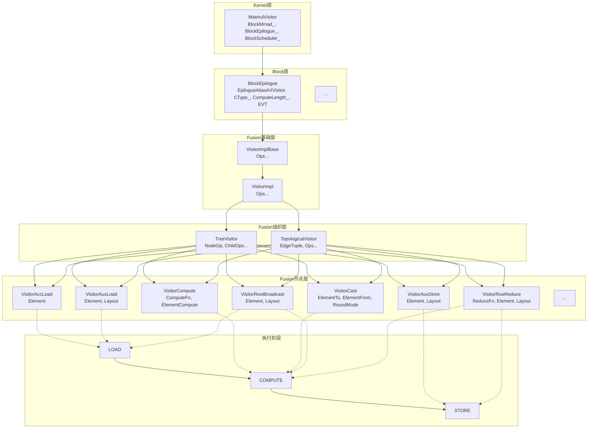
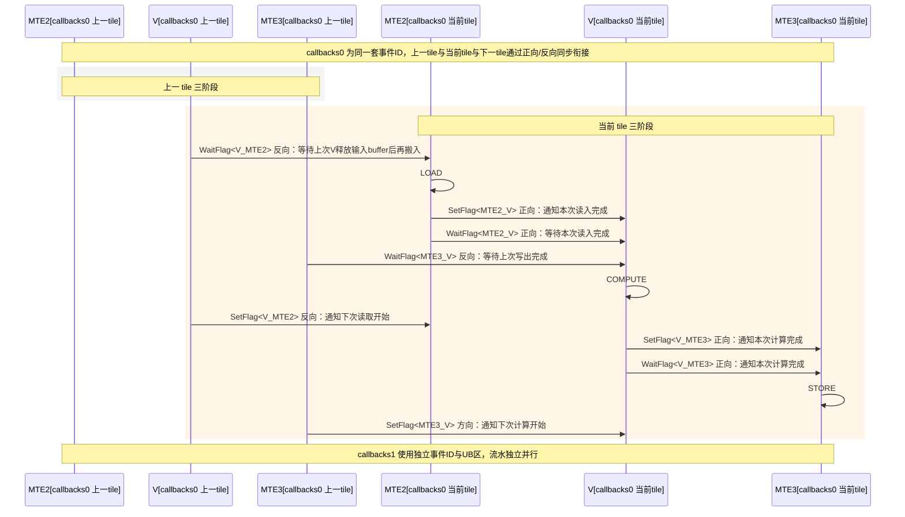
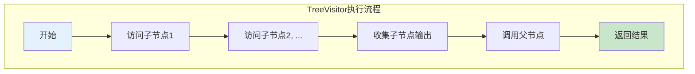
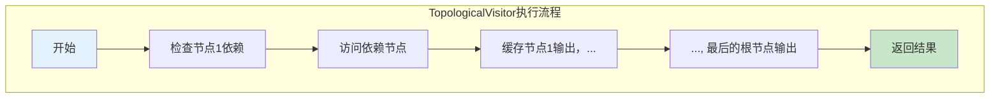
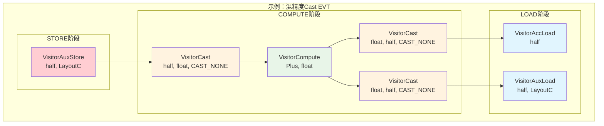

# Catlass Epilogue Visitor Tree（EVT）设计文档

## 1. 简介

### 背景
Catlass是面向AscendC的模板库，对标CUTLASS语义，为NPU提供高效的矩阵运算能力。在GEMM（General Matrix Multiply）运算中，Epilogue阶段负责对矩阵乘法结果进行后处理，将后处理操作抽象为模板节点的任意拼接，实现灵活的组合与复用。

### 核心挑战
- **算子多样性**：Epilogue算子种类繁多（加法、类型转换、行广播、行规约等），需要统一组织与复用机制。
- **UB空间受限**：AscendC的Unified Buffer空间有限，需精细管理UB分配与流水，避免空间浪费。
- **并发同步复杂**：MTE2/MTE3与V流水线并发执行，事件同步方向易错，需要清晰的同步语义。
- **组合复杂性**：不同应用场景需要不同的算子组合，需要支持任意拼接与嵌套。

### Catlass应对策略

#### 1. 模板节点任意拼接
- **TreeVisitor**：支持树形结构的节点组合，父节点可以依赖多个子节点
- **TopologicalVisitor**：支持DAG拓扑结构，允许节点有多个消费者，如`(C+X)+(C+X)`中的`(C+X)`
- **嵌套组合**：支持任意深度的嵌套组合

#### 2. 三阶段语义
- **LOAD阶段**：数据从GM加载到UB，包括AccLoad、AuxLoad等
- **COMPUTE阶段**：在UB中进行计算，包括Compute、Cast等操作
- **STORE阶段**：将结果写回GM，包括AuxStore等

#### 3. 资源管理
- **UB自动分配**：根据节点类型和计算长度自动分配UB空间
- **双缓冲流水**：通过三阶段分阶段执行与事件同步实现数据搬运与计算完全并行
- **类型安全**：通过模板参数确保类型安全，支持混合精度计算过程

#### 4. 灵活的复用机制
- **节点缓存**：TopologicalVisitor支持节点输出缓存，避免重复计算
- **参数复用**：支持同一节点在不同位置使用不同参数
- **模板特化**：针对不同硬件特性进行模板特化优化

## 2. 系统设计方案概述

### 架构示意图

#### 图1：EVT架构（分层 + 节点族 + 阶段映射）



### API表

| API Name| Class Template | Features |
|-----------|----------------|----------|
| MatmulVisitor | `Gemm::Kernel::MatmulVisitor<BlockMmad_, BlockEpilogue_, BlockScheduler_>` | EVT入参桥接、Workspace组织 |
| BlockEpilogue | `Epilogue::Block::BlockEpilogue<EpilogueAtlasAXVisitor, CType_, ComputeLength_, EVT>` | Tile划分、双缓冲、事件同步 |
| Fusion Base | `Epilogue::Fusion::VisitorImplBase<Ops...>` | Arguments/Params汇聚、workspace计量、can_implement校验 |
| Fusion Impl | `Epilogue::Fusion::VisitorImpl<Ops...>` | 节点规范、get_callbacks统一构建、Callbacks生命周期钩子 |
| Tree Visitor | `Epilogue::Fusion::TreeVisitor<NodeOp, ChildOps...>` | 树形模板，父后子先遍历，按阶段传递子输出 |
| Topological Visitor | `Epilogue::Fusion::TopologicalVisitor<EdgeTuple, Ops...>` | DAG拓扑复用与节点缓存，根节点驱动全图 |
| Compute | `Epilogue::Fusion::VisitorCompute<ComputeFn, ElementCompute>` | 逐元素算子（如Plus/Maximum/Minimum） |
| Cast | `Epilogue::Fusion::VisitorCast<ElementTo, ElementFrom, RoundMode>` | 类型转换（含RoundMode） |
| Acc Load | `Epilogue::Fusion::VisitorAccLoad<Element>` | 从GEMM Block块工作区块按局部坐标Load |
| Aux Load | `Epilogue::Fusion::VisitorAuxLoad<Element, Layout>` | 从用户GM按全局坐标Load |
| Aux Store | `Epilogue::Fusion::VisitorAuxStore<Element, Layout>` | 写回用户GM（STORE阶段） |
| Row Broadcast | `Epilogue::Fusion::VisitorRowBroadcast<Element, Layout>` | 1xN行向量广播到MxN tile |
| Row Reduce | `Epilogue::Fusion::VisitorRowReduce<ReduceFn, Element, Layout>` | 按行规约到1xN并原子加到GM |

### 2.1 多层级API（Kernel）

AIC每算完一个A*B分块，对C分块进行后处理。
- 用户以 EVT 定义后处理，并构造 `EVT::Arguments evt_args`；
- Kernel 将 `problemShape, ptrA, ptrB, evt_args` 打包为 `MatmulVisitor::Arguments`；
- 计算 `GetWorkspaceSize`（= GEMM 的 C 工作区 + EVT 的 workspace 对齐和），调用initalize_workspace()；
- 调用 `ToUnderlyingArguments`：先组织 A/B/C 的布局与 workspace，再用 `EVT::to_underlying_arguments` 生成 Fusion 层 `Params`；
- AIC 完成小块A*B 并写入 C(workspace)；AIV 等待跨核 flag 后执行 BlockEpilogue。
- 在end_epilogue场景可能需要在最后进行BlockEpilogue.end()

### 2.2 多层级API（Block）

#### 图2：双缓冲六流水（callbacks0 上一 tile 三条 + 当前 tile 三条），同步关系（按生产/消费语义）



block_epilogue计算粒度与AIC矩阵乘相同，根据compute_length计算出最大tile_shape，以tile_shape为粒度迭代进行C子块的处理，每个节点以隐含的tile_shape大小的row_major layout的形式在UB进行传递。

- 构造 `BlockEpilogue(resource, {evt_params})` 时，分配事件ID并设置初始 flag（允许 MTE2 搬入与 V 写出）；
- 子块划分：将 Block C 的实际形状按子核维度拆成子块；
- 为双缓冲分配两套 `Callbacks`：通过 `evt.get_callbacks(resource, ub_offset, COMPUTE_LENGTH, ...)` 申请 UB 片段，并构建各 Visitor 回调；
- 进入 tile 循环：交替选择 callbacks0/1，按事件次序发起三阶段：
  - LOAD：Wait V_MTE2 → visit(..., LOAD) → Set MTE2_V；
  - COMPUTE：Wait MTE2_V & MTE3_V → visit(..., COMPUTE) → Set V_MTE2 & V_MTE3；
  - STORE：Wait V_MTE3 → visit(..., STORE) → Set MTE3_V；
- callbacks0/1交替进行，形成搬入/计算/搬出并行的双缓冲流水。

### 2.3 多层级API（Fusion）

#### 图3：TreeVisitor vs TopologicalVisitor 执行流程




- 以 TreeVisitor/TopologicalVisitor 描述计算图；
- 按树的父子关系嵌套，或以 `Edges` 指定拓扑；
- 根据各 Visitor 的 `Arguments` 顺序构造 `EVT::Arguments`；

#### Arguments API说明

| Visitor类型 | Arguments结构 | 参数说明 |
|-------------|---------------|----------|
| `VisitorAccLoad` | `Arguments{}` | 无参数，从GEMM工作区块加载 |
| `VisitorAuxLoad` | `Arguments{ptr_aux, layout}` | 需要GM地址和布局 |
| `VisitorAuxStore` | `Arguments{ptr_aux, layout}` | 需要GM地址和布局 |
| `VisitorCompute` | `Arguments{}` | 无参数，纯计算操作 |
| `VisitorCast` | `Arguments{}` | 无参数，类型转换 |
| `VisitorRowBroadcast` | `Arguments{ptr_row, layout}` | 需要行向量地址和布局 |
| `VisitorRowReduce` | `Arguments{ptr_row_out, layout, identity}` | 需要输出地址、布局和初始值；原子由ReduceFn确定 |
| ... | ... | ... |

#### 1) `visitor_impl_base`
- `Arguments/Params`汇聚：统一参数管理
- workspace计量：对齐的workspace计算
- `can_implement`一致性校验：确保所有节点可执行

#### 2) `visitor_impl`
- 节点规范：统一的`get_callbacks`接口
- `Callbacks`生命周期钩子统一接口：`visit`/`begin_epilogue`/`end_epilogue`

- 由于需要进行自动流水管理，回调对象的visit函数带有VisitStage类型枚举参数，指示当前进行哪个阶段的指令操作。

```c++
enum class VisitStage : uint8_t {
    LOAD = 0,      // 执行所有load指令
    COMPUTE = 1,   // 执行所有compute指令
    STORE = 2,     // 执行所有store指令
};
```
根据自动流水管理的需求，每个节点的visit实现需要将AscendC指令包含在类似if (stage == VisitStage::COMPUTE) {}等条件语句中。否则无法保证流水的正确与双缓冲的形成。
一个节点可以包含在多个阶段中，比如broadcast节点可以同时包含LOAD阶段和COMPUTE阶段的指令。
PIPE内的同步指令需要在节点内进行，如AscendC::PipeBarrier<PIPE_V>();

#### 3) `tree_visitor`
- 参考模版形态，第一个为父节点
- 树形模板：父后子先遍历
- 按阶段传递子输出：收集子节点输出传给父节点

组合逻辑与 Arguments 顺序：
- 模板形态：`TreeVisitor<ParentOp, ChildOp1, ChildOp2, ...>`
- 参数顺序：`typename EVT::Arguments{ (ChildOp1::Arguments, ChildOp2::Arguments, ...), ParentOp::Arguments }`
- TreeVisitor 的 Arguments 书写顺序与模板声明相反——父节点的 Arguments 永远写在该层最后（先写所有子节点的 Arguments，再写父节点）。
- 示例：
```cpp
// (C + X) 写回 D（父最后写）
using EVT = TreeVisitor<
  VisitorAuxStore<half, LayoutC>,
  TreeVisitor<VisitorCompute<Plus, half>, VisitorAccLoad<half>, VisitorAuxLoad<half, LayoutC>>
>;
typename EVT::Arguments args{
  { /* inner children then parent */ ArgsAccLoad{}, ArgsAuxLoad{deviceX, layoutD}, ArgsCompute{} },
  /* outer parent */ ArgsStore{deviceD, layoutD}
};
```
- 执行阶段：TreeVisitor 的回调以“先访问子节点、收集输出，再调用父节点”的顺序在每个阶段（LOAD/COMPUTE/STORE）分发。

#### 4) `topological_visitor`
- 参考模板形态，所以节点以拓扑序（依赖少的在前，依赖多的在后）平铺，最后一个节点为输出节点
- DAG拓扑复用：支持节点复用（如`(C+X)+(C+X)`）
- 节点缓存：按输出阶段缓存结果

组合逻辑与参数顺序：
- 模板形态：`TopologicalVisitor<EdgeTuple, Op0, Op1, ..., OpN>`，其中 `EdgeTuple` 指定每个索引的子依赖（最终根为索引 N）。
- 参数顺序：`typename EVT::Arguments{ Op0::Arguments, Op1::Arguments, ..., OpN::Arguments }`（严格按 `Ops...` 顺序）。
- 复用：同一算子类型可在 `Ops...` 中出现多次（如 Compute1/Compute2），其 Arguments 对应位置各自独立；回调执行时按 `EdgeTuple` 依赖关系决定访问序与缓存命中。
- 示例：
```cpp
using Edges = tla::tuple<
  tla::seq<>,        // 0: AccLoad
  tla::seq<>,        // 1: AuxLoad
  tla::seq<0, 1>,    // 2: Compute1 = C + X
  tla::seq<2, 2>,    // 3: Compute2 = (C+X) + (C+X)
  tla::seq<3>        // 4: Store
>;
using EVT = TopologicalVisitor<Edges,
  VisitorAccLoad<half>, VisitorAuxLoad<half, LayoutC>,
  VisitorCompute<Plus, half>, VisitorCompute<Plus, half>,
  VisitorAuxStore<half, LayoutC>
>;
typename EVT::Arguments args{ {}, {deviceX, layoutD}, {}, {}, {deviceD, layoutD} };
```
缓存语义：仅在各算子的输出阶段（非 STORE）缓存，避免覆盖带副作用的写回。

由于语义需要：每个节点需要在类内声明类似
- using ElementOutput = Element;

以便于TopologicalVisitor仅在各节点的输出阶段缓存节点的输出，而不用再次访问。
- static constexpr VisitStage OUTPUT_STAGE = VisitStage::COMPUTE;

以便于TopologicalVisitor申请对应输出类型的缓存引用对象。

#### 5) `visitor_compute`
- 须作为父节点使用
- 仅支持逐元素算子：如`Plus`、`Minus`等
- 可接受任意个子节点，需要对应满足ComputeFn的参数要求
- 类型匹配：确保输入类型一致

#### 6) `visitor_cast`

- 须作为父节点使用，仅支持一个子节点
- 类型转换：支持不同精度转换
- RoundMode：支持不同的舍入模式

#### 7) `visitor_acc_load`
- 可作为叶子节点独立存在
- 从GEMM工作区块按局部坐标Load
- 使用`gmSubblockC`和`layoutSubblockC`

#### 8) `visitor_aux_load`
- 可作为叶子节点独立存在
- 从用户GM按全局坐标Load
- 使用用户提供的`ptr_aux`和`layout`

#### 9) `visitor_aux_store`
- 须作为父节点使用，仅支持一个子节点，可继续作为子节点
- 写回用户GM（STORE阶段）
- 不直接配置原子；原子写回由`VisitorRowReduce`控制

#### 10) `visitor_row_broadcast`
- 可作为叶子节点独立存在，包含LOAD、COMPUTE双阶段，返回广播后的tile结果
- 1xN行向量广播到MxN tile
- 支持行复制

#### 11) `visitor_row_reduce`
- 须作为父节点使用，仅支持一个子节点，包含COMPUTE、STORE双阶段，可继续作为子节点，返回的是规约前的内容
- 按行规约到1xN并原子加到GM
- 当前仅支持tile间原子加出全局结果

### 2.4 使用场景

结合`examples/32/33/34/35`展示：

#### 示例32：C+X（基础加法）

**EVT定义：**
```cpp
using EVT = Epilogue::Fusion::TreeVisitor<
    Epilogue::Fusion::VisitorAuxStore<half, LayoutC>,
    Epilogue::Fusion::TreeVisitor<
        Epilogue::Fusion::VisitorCompute<Epilogue::Fusion::Plus, half>,
        Epilogue::Fusion::VisitorAccLoad<half>,
        Epilogue::Fusion::VisitorAuxLoad<half, LayoutC>
    >
>;
```
##### 典型用户流程说明(以示例32为例)

```cpp
    constexpr uint32_t computeLength = 8192;
    
    using EVT = Epilogue::Fusion::TreeVisitor<
        Epilogue::Fusion::VisitorAuxStore<half, LayoutC>,
        Epilogue::Fusion::TreeVisitor<
            Epilogue::Fusion::VisitorCompute<Epilogue::Fusion::Plus, half>,
            Epilogue::Fusion::VisitorAccLoad<half>,  // 加载 A*B
            Epilogue::Fusion::VisitorAuxLoad<half, LayoutC>   // 加载 X
        >
    >;

    // Block level, define BlockEpilogue with EVT
    using BlockEpilogue = Epilogue::Block::BlockEpilogue<
        Epilogue::EpilogueAtlasA2Visitor,
        CType,
        tla::Int<computeLength>,
        EVT
    >;

    // 准备 EVT Arguments
    typename EVT::Arguments evt_args{
        {
            {},
            {deviceX, layoutD},
            {}
        },
        {deviceD, layoutD}
    };

    using BlockScheduler = typename Gemm::Block::GemmIdentityBlockSwizzle<3, 0>;
    // Kernel level
    using MatmulKernel = Gemm::Kernel::MatmulVisitor<BlockMmad, BlockEpilogue, BlockScheduler>;
    // Prepare params
    typename MatmulKernel::Arguments arguments{options.problemShape, deviceA, deviceB, evt_args};
    using MatmulAdapter = Gemm::Device::DeviceGemm<MatmulKernel>;
    MatmulAdapter matmulOp;
    size_t sizeWorkspace = matmulOp.GetWorkspaceSize(arguments);
    uint8_t *deviceWorkspace{nullptr};
    if (sizeWorkspace > 0) {
        ACL_CHECK(aclrtMalloc(reinterpret_cast<void **>(&deviceWorkspace), sizeWorkspace, ACL_MEM_MALLOC_HUGE_FIRST)
        );
    }
    matmulOp.Initialize(arguments, deviceWorkspace);
    matmulOp(stream, aicCoreNum, fftsAddr);
    ACL_CHECK(aclrtSynchronizeStream(stream));
    if (sizeWorkspace > 0) {
        ACL_CHECK(aclrtFree(deviceWorkspace));
    }
```

**Arguments构造：**
```cpp
typename EVT::Arguments evt_args{
    {
        {},                    // VisitorAccLoad::Arguments{}
        {deviceX, layoutD},    // VisitorAuxLoad::Arguments{ptr_aux, layout}
        {}                     // VisitorCompute::Arguments{}
    },
    {deviceD, layoutD}          // VisitorAuxStore::Arguments{ptr_aux, layout}
};
```

#### 示例33：混精度Cast
#### 图4：EVT组合示例 - 混精度计算流程


**EVT定义：**
```cpp
using EVT = Epilogue::Fusion::TreeVisitor<
    EVT_Store,
    Epilogue::Fusion::TreeVisitor<EVT_CastOut, EVT_Inner>
>;
```

**Arguments构造：**
```cpp
typename EVT::Arguments evt_args{
    {
        {
            {
                {},                   // VisitorAccLoad::Arguments{}
                {}                    // VisitorCast::Arguments{}
            },
            {
                {deviceX, layoutD},   // VisitorAuxLoad::Arguments{ptr_aux, layout}
                {}                    // VisitorCast::Arguments{}
            },
            {}                        // VisitorCompute::Arguments{}
        },
        {}                            // VisitorCast::Arguments{}
    },
    {deviceD, layoutD}                // VisitorAuxStore::Arguments{ptr_aux, layout}
};
```

#### 示例34：拓扑复用

**EVT定义：**
```cpp
using Edges = tla::tuple<
    tla::seq<>,         // 0: AccLoad 无子节点
    tla::seq<>,         // 1: AuxLoad 无子节点
    tla::seq<0, 1>,     // 2: Compute1 依赖 AccLoad 与 AuxLoad
    tla::seq<2, 2>,     // 3: Compute2 依赖 Compute1 与 Compute1（复用）
    tla::seq<3>         // 4: Store 依赖 Compute2
>;

using EVT = Epilogue::Fusion::TopologicalVisitor<
    Edges,
    Epilogue::Fusion::VisitorAccLoad<half>,
    Epilogue::Fusion::VisitorAuxLoad<half, LayoutC>,
    Epilogue::Fusion::VisitorCompute<Epilogue::Fusion::Plus, half>,
    Epilogue::Fusion::VisitorCompute<Epilogue::Fusion::Plus, half>,
    Epilogue::Fusion::VisitorAuxStore<half, LayoutC>
>;
```

**Arguments构造：**
```cpp
typename EVT::Arguments evt_args{
    {},                 // 0: VisitorAccLoad::Arguments{}
    {deviceX, layoutD}, // 1: VisitorAuxLoad::Arguments{ptr_aux, layout}
    {},                 // 2: VisitorCompute::Arguments{}
    {},                 // 3: VisitorCompute::Arguments{}
    {deviceD, layoutD}  // 4: VisitorAuxStore::Arguments{ptr_aux, layout}
};
```

#### 示例35：行广播+规约

**EVT定义：**
```cpp
using EVT = Epilogue::Fusion::TreeVisitor<
    Epilogue::Fusion::VisitorRowReduce<Epilogue::Fusion::Plus, float, layout::RowMajor>,
    Epilogue::Fusion::TreeVisitor<
        Epilogue::Fusion::VisitorCast<float, half>,
        Epilogue::Fusion::TreeVisitor<
            Epilogue::Fusion::VisitorAuxStore<half, LayoutC>,
            Epilogue::Fusion::TreeVisitor<
                Epilogue::Fusion::VisitorCompute<Epilogue::Fusion::Plus, half>,
                Epilogue::Fusion::VisitorAccLoad<half>,
                Epilogue::Fusion::VisitorRowBroadcast<half, layout::RowMajor>
            >
        >
    >
>;
```

**Arguments构造：**
```cpp
typename EVT::Arguments evt_args{
    {
        {
            {
                {
                    {},                                    // VisitorAccLoad::Arguments{}
                    {deviceRow, layout::RowMajor{1, n}},   // VisitorRowBroadcast::Arguments{ptr_row, layout}
                    {}                                     // VisitorCompute::Arguments{}
                },
                {deviceD, layoutD}                         // VisitorAuxStore::Arguments{ptr_aux, layout}
            },
            {}                                             // VisitorCast::Arguments{}
        },
        {deviceRowOut, layout::RowMajor{1, n}, 0.0f}      // VisitorRowReduce::Arguments{ptr_row_out, layout, identity}
    }
};
```

