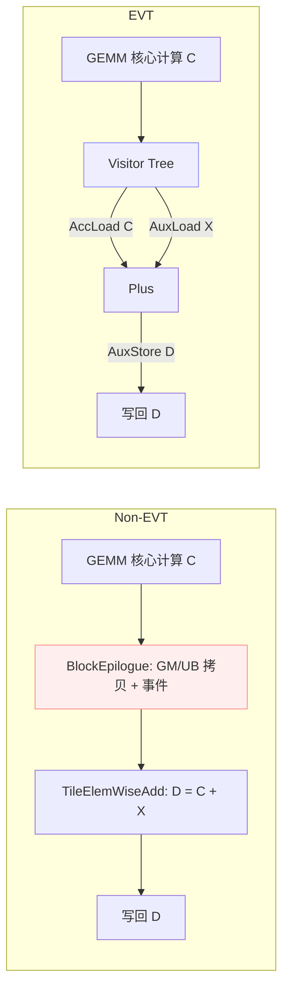

## 简介

本页以 `Matmul + Add` 为例，对比未使用 EVT 与使用 EVT 两种实现方式，展示EVT在开发便捷性与可扩展性上的优势，并进行性能的对比评估。

参考样例：
- 未使用 EVT：`examples/03_matmul_add/matmul_add.cpp`
- 使用 EVT：`examples/32_matmul_add_evt/matmul_add_evt.cpp`

相关实现要点：
- `include/catlass/epilogue/block/block_epilogue_elemwise_one_source.hpp`
- `include/catlass/epilogue/tile/tile_elemwise_add.hpp`
- `include/catlass/epilogue/fusion/operations.hpp` 中 `Plus`

## 背景与概念

- 未使用 EVT：需显式特化单源blockEpilogue模版，包含 GM→UB/UB→GM 拷贝、事件同步、以及逐元素计算（如 `TileElemWiseAdd`），需要开发者亲自组织访存与事件。
- 使用 EVT：通过 Visitor/Fusion 的描述式树形拼装`visitor节点`，由框架负责数据流、事件与计算算子串接，开发者以“表达式”方式声明 Epilogue。

## 结构图



## 基线样例（未使用 EVT）

要点：
- `TileElemWiseAdd` 完成逐元素加法；
- `BlockEpilogue` 负责 C/X/D 的 GM↔UB 搬运与事件编排；
- 调用端需要组合 `BlockMmad + BlockEpilogue + BlockScheduler` 并准备 workspace。

代表性片段：

```cpp
// include/catlass/epilogue/tile/tile_elemwise_add.hpp
// 逐元素加法：ubOut = ubIn0 + ubIn1
AscendC::Add(ubOut, ubIn0, ubIn1, COMPUTE_LENGTH);
```

```cpp
// include/catlass/epilogue/block/block_epilogue_elemwise_one_source.hpp
// 复制 C/X 到 UB，计算 D，再写回 D（含事件同步）
copyGmToUbC(ubC, gmSubblockC, layoutComputeInUb, layoutSubblockC);
copyGmToUbX(ubX, gmSubblockX, layoutComputeInUb, layoutSubblockX);
tileEpilogue(ubD, ubC, ubX);
copyUbToGmD(gmSubblockD, ubD, layoutSubblockD, layoutComputeInUb);
```

```cpp
// examples/03_matmul_add/matmul_add.cpp（选摘）
constexpr uint32_t computeLength = 16384;
using TileElemWiseEpilogue = Epilogue::Tile::TileElemWiseAdd<ArchTag, ComputeType, computeLength>;
using BlockEpilogue = Epilogue::Block::BlockEpilogue<
  EpilogueDispatchPolicy, CType, XType, DType, TileElemWiseEpilogue, EpilogueTileCopy>;
using MatmulKernel = Gemm::Kernel::MatmulEpilogue<BlockMmad, BlockEpilogue, BlockScheduler>;
```

开发负担：需要显式处理 UB 容量、事件旗标、子块布局、GM 偏移等细节；当算子链路变复杂（Add+Bias+Act+...）时组合与调度复杂度提升明显。

## EVT 样例（使用 EVT）

要点：
- 以 Visitor/Fusion 方式描述 D = C + X：`AccLoad(C) + AuxLoad(X)` → `Plus` → `AuxStore(D)`；
- `Plus` 的实现依旧是底层 `AscendC::Add`，但数据流/事件由框架拼装完成；
- 调用端以 `MatmulVisitor` 接入，无需直接管理 UB/事件细节。

代表性片段：

```cpp
// include/catlass/epilogue/fusion/operations.hpp (64-76)
// Plus：底层仍调用 AscendC::Add
AscendC::Add(dst, src0, src1, compute_length);
```

```cpp
// examples/32_matmul_add_evt/matmul_add_evt.cpp（选摘）
constexpr uint32_t computeLength = Epilogue::EpilogueAtlasA2Visitor::ArchTag::UB_SIZE /3/2/sizeof(half); //16384
using EVT = Epilogue::Fusion::TreeVisitor<
  Epilogue::Fusion::VisitorAuxStore<half, LayoutD>,
  Epilogue::Fusion::TreeVisitor<
    Epilogue::Fusion::VisitorCompute<Epilogue::Fusion::Plus, half>,
    Epilogue::Fusion::VisitorAccLoad<half>,
    Epilogue::Fusion::VisitorAuxLoad<half, LayoutX>
  >>;
using BlockEpilogue = Epilogue::Block::BlockEpilogue<
  Epilogue::EpilogueAtlasA2Visitor, CType, tla::Int<computeLength>, EVT>;
using MatmulKernel = Gemm::Kernel::MatmulVisitor<BlockMmad, BlockEpilogue, BlockScheduler>;
```

开发便捷性：通过“表达式式”树结构声明计算逻辑，减少手写搬运/事件/布局逻辑；当扩展为多算子链路时，仅需增添 Visitor 节点，无需重写调度细节。

## 差异总结（开发便捷性）

- 非 EVT：手工组织 GM/UB 拷贝、事件等待/置位、UB 布局、块/子块切分；修改算子链路需要同步修改调度细节。
- EVT：以 Visitor Tree 声明式拼装，框架负责数据流与事件；易于扩展与维护，可复用算子节点（如 `Plus`、`Mul`、`Activation`）。

## 性能对比

使用msprof op进行采集，OpBasicInfo的Task Duration(us)，和所有核中最大的PipeUtilization.csv中的aiv_vec_time(us)
表格：

| m | n | k | 实现 | Task Duration(us) | max_aiv_vec_time(us) | 备注 |
|---:|---:|---:|:---|---:|---:|:---|
| 8192 | 8192 | 8192 | 非 EVT | 4279.900391 | 16.026112 |  |
| 8192 | 8192 | 8192 | EVT | 4280.200195 | 16.003334 |  |

# matmul add relu(D=relu(A*B+X))

类似的，可以在matmul+add的基础上，通过

non-EVT
```cpp
// include/catlass/epilogue/tile/tile_elemwise_add_relu.hpp
AscendC::Add(ubOut, ubIn0, ubIn1, COMPUTE_LENGTH);
AscendC::Relu(ubOut, ubOut, COMPUTE_LENGTH);
```
EVT
```cpp
// 加法操作符
template <typename T>
struct PlusRelu {
    CATLASS_DEVICE
    void operator()(
        AscendC::LocalTensor<T>& dst,
        AscendC::LocalTensor<T> const& src0,
        AscendC::LocalTensor<T> const& src1,
        uint32_t compute_length
    ) const {
        AscendC::Add(dst, src0, src1, compute_length);
        AscendC::Relu(dst, dst, compute_length);
    }
};
```
实现D=relu(A*B+X)。

## 性能对比

使用msprof op进行采集，OpBasicInfo的Task Duration(us)，和所有核中最大的PipeUtilization.csv中的aiv_vec_time(us)
表格：

| m | n | k | 实现 | Task Duration(us) | max_aiv_vec_time(us) | 备注 |
|---:|---:|---:|:---|---:|---:|:---|
| 8192 | 8192 | 8192 | 非 EVT | 4271.000000 | 29.018333 | |
| 8192 | 8192 | 8192 | EVT | 4274.520020 | 28.983889 |  |