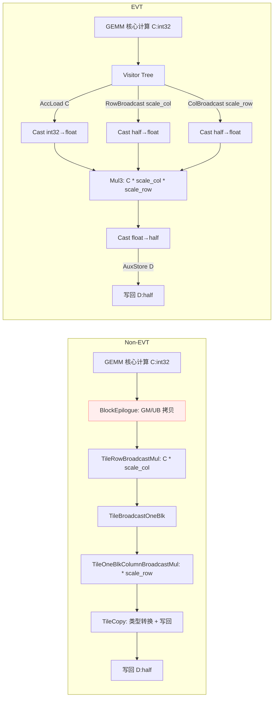

## 简介

本页以量化矩阵乘法（QuantMatmul）为例，对比未使用 EVT 与使用 EVT 两种实现方式，展示EVT在开发便捷性与可扩展性上的优势，并进行性能的对比评估。

计算流程：`D = half(float(int32_t C) * scale_col * scale_row)`，其中 `C = A * B`（A、B 为 int8_t，C 为 int32_t 累加结果），`scale_col` 为列向量（形状 {1, n}），`scale_row` 为行向量（形状 {m, 1}）。

参考样例：
- 未使用 EVT：`examples/12_quant_matmul/quant_matmul.cpp`
- 使用 EVT：`examples/12_quant_matmul_evt/quant_matmul_evt.cpp`

相关实现要点：
- `include/catlass/epilogue/tile/tile_broadcast_mul.hpp` 中 `TileRowBroadcastMul`、`TileOneBlkColumnBroadcastMul`
- `include/catlass/epilogue/tile/tile_broadcast_one_blk.hpp` 中 `TileBroadcastOneBlk`
- `include/catlass/epilogue/fusion/visitor_row_broadcast.hpp` 中 `VisitorRowBroadcast`
- `include/catlass/epilogue/fusion/visitor_col_broadcast.hpp` 中 `VisitorColBroadcast`
- `include/catlass/epilogue/fusion/operations.hpp` 中 `Mul3`
- `include/catlass/epilogue/block/block_epilogue_per_token_dequant.hpp`

## 背景与概念

- 未使用 EVT：需显式组合多个 Tile 操作，包括 `TileRowBroadcastMul`（行广播 scale_col）、`TileBroadcastOneBlk`（单块广播）、`TileOneBlkColumnBroadcastMul`（列广播 scale_row）、`TileCopy`（类型转换与写回），需要开发者亲自组织 GM→UB/UB→GM 拷贝、事件同步、以及类型转换与广播计算。
- 使用 EVT：通过 Visitor/Fusion 的描述式树形拼装 `visitor节点`，由框架负责数据流、事件与计算算子串接，开发者以“表达式”方式声明 Epilogue，通过 `VisitorRowBroadcast`、`VisitorColBroadcast`、`VisitorCompute<Mul3>` 等节点描述广播和三元乘法操作。

## 结构图



## 基线样例（未使用 EVT）

要点：
- `TileRowBroadcastMul` 完成行广播乘法（将 {1, n} 的 scale_col 广播到 {m, n} 并与 C 相乘）；
- `TileBroadcastOneBlk` 完成单块广播，用于中间结果的布局转换；
- `TileOneBlkColumnBroadcastMul` 完成列广播乘法（将 {m, 1} 的 scale_row 广播到 {m, n} 并相乘）；
- `TileCopy` 负责类型转换（float→half）和写回；
- `BlockEpilogue` 负责 C/Scale/PerTokenScale/D 的 GM↔UB 搬运、事件编排与多个 Tile 操作的串接；
- 调用端需要组合 `BlockMmad + BlockEpilogue + BlockScheduler` 并准备 workspace。

代表性片段：

```cpp
// include/catlass/epilogue/tile/tile_broadcast_mul.hpp
// TileRowBroadcastMul：行广播乘法，将 {1, n} 广播到 {m, n}
AscendC::Mul(
    ubOut[rowOffset * TileShape::COLUMN + colOffset],
    ubIn0[rowOffset * TileShape::COLUMN + colOffset],
    ubIn1[colOffset],
    mask, repeatTimes, repeatParams
);
```

```cpp
// include/catlass/epilogue/tile/tile_broadcast_mul.hpp
// TileOneBlkColumnBroadcastMul：列广播乘法，将 {m, 1} 广播到 {m, n}
AscendC::Mul(
    ubOut[rowOffset * TileShape::COLUMN + colOffset],
    ubIn0[rowOffset * TileShape::COLUMN + colOffset],
    ubIn1[rowOffset * eleNumPerBlk],
    mask, repeatTimes, repeatParams
);
```

```cpp
// examples/12_quant_matmul/quant_matmul.cpp（选摘）
using EpilogueTileShape = MatrixShape<32, 256>;
using TileRowBroadcastMul = Epilogue::Tile::TileRowBroadcastMul<ArchTag, RowBroadcastMulType, EpilogueTileShape>;
using TileBroadcastOneBlk =
    Epilogue::Tile::TileBroadcastOneBlk<ArchTag, BroadcastOneBlkType, EpilogueTileShape::ROW>;
using TileOneBlkColumnBroadcastMul =
    Epilogue::Tile::TileOneBlkColumnBroadcastMul<ArchTag, OneBlkColumnBroadcastMulType, EpilogueTileShape>;
using TileCopy = Epilogue::Tile::TileCopy<ArchTag, CType, ScaleType, PerTokenScaleType, DType>;
using TileScheduler = Epilogue::Tile::EpilogueHorizontalTileSwizzle;

using BlockEpilogue = Epilogue::Block::BlockEpilogue<
    EpilogueDispatchPolicy, CType, ScaleType, PerTokenScaleType, DType,
    TileRowBroadcastMul, TileBroadcastOneBlk, TileOneBlkColumnBroadcastMul, TileCopy, TileScheduler>;
using MatmulKernel = Gemm::Kernel::QuantMatmulMultiStageWorkspace<BlockMmad, BlockEpilogue, BlockScheduler, workspaceStages>;
```

开发负担：需要显式处理 UB 容量、事件旗标、子块布局、GM 偏移等细节；需要协调多个 Tile 操作的执行顺序和中间结果存储；当算子链路变复杂时需要手动管理更多中间状态和类型转换。

## EVT 样例（使用 EVT）

要点：
- 以 Visitor/Fusion 方式描述 `D = half(float(C) * scale_col * scale_row)`：通过 `VisitorAccLoad<int32_t>` 加载累加器 C，通过 `VisitorCast<float, int32_t>` 转换为 float；通过 `VisitorRowBroadcast` 加载并广播 scale_col（{1, n} → {m, n}），通过 `VisitorCast<float, half>` 转换为 float；通过 `VisitorColBroadcast` 加载并广播 scale_row（{m, 1} → {m, n}），通过 `VisitorCast<float, half>` 转换为 float；通过 `VisitorCompute<Mul3, float>` 执行三元乘法；通过 `VisitorCast<half, float>` 转换回 half；最后通过 `VisitorAuxStore<half>` 写回 D；
- `Mul3` 的实现依旧是底层 `AscendC::Mul`（两次调用），但数据流/事件由框架拼装完成；
- 调用端以 `MatmulVisitor` 接入，无需直接管理 UB/事件/类型转换细节。

代表性片段：

```cpp
// include/catlass/epilogue/fusion/operations.hpp (92-107)
// Mul3：三元乘法，执行 dst = src0 * src1 * src2
template <typename T>
struct Mul3 {
    CATLASS_DEVICE
    void operator()(
        AscendC::LocalTensor<T>& dst,
        AscendC::LocalTensor<T> const& src0,
        AscendC::LocalTensor<T> const& src1,
        AscendC::LocalTensor<T> const& src2,
        uint32_t compute_length
    ) const {
        AscendC::Mul(dst, src0, src1, compute_length);
        AscendC::PipeBarrier<PIPE_V>();
        AscendC::Mul(dst, dst, src2, compute_length);
    }
};
```

```cpp
// examples/12_quant_matmul_evt/quant_matmul_evt.cpp（选摘）
// EVT: D = half( float(C) * scale_col * scale_row )
constexpr uint32_t computeLength = 3072;
using EVT = Epilogue::Fusion::TreeVisitor<
    Epilogue::Fusion::VisitorAuxStore<half, layout::RowMajor>,
    Epilogue::Fusion::TreeVisitor<
        Epilogue::Fusion::VisitorCast<half, float>,
        Epilogue::Fusion::TreeVisitor<
            Epilogue::Fusion::VisitorCompute<Epilogue::Fusion::Mul3, float>,
            Epilogue::Fusion::TreeVisitor<
                Epilogue::Fusion::VisitorCast<float, int32_t>,
                Epilogue::Fusion::VisitorAccLoad<int32_t>
            >,
            Epilogue::Fusion::TreeVisitor<
                Epilogue::Fusion::VisitorCast<float, half>,
                Epilogue::Fusion::VisitorRowBroadcast<half, layout::RowMajor>
            >,
            Epilogue::Fusion::TreeVisitor<
                Epilogue::Fusion::VisitorCast<float, half>,
                Epilogue::Fusion::VisitorColBroadcast<half, layout::RowMajor>
            >
        >
    >
>;

using BlockEpilogue = Epilogue::Block::BlockEpilogue<
    Epilogue::EpilogueAtlasA2Visitor, CType, tla::Int<computeLength>, EVT>;
using MatmulKernel = Gemm::Kernel::MatmulVisitor<BlockMmad, BlockEpilogue, BlockScheduler>;
```

开发便捷性：通过“表达式式”树结构声明计算逻辑（包含类型转换、广播、三元乘法），减少手写搬运/事件/布局逻辑；当扩展为多算子链路时，仅需增添 Visitor 节点（如添加激活函数、Bias 等），无需重写调度细节；类型转换通过 `VisitorCast` 节点自动处理，无需显式管理中间类型。

## 差异总结（开发便捷性）

- 非 EVT：手工组织 GM/UB 拷贝、事件等待/置位、UB 布局、块/子块切分；需要显式组合多个 Tile 操作（TileRowBroadcastMul、TileBroadcastOneBlk、TileOneBlkColumnBroadcastMul、TileCopy）并管理执行顺序；需要手动处理类型转换和中间结果存储；修改算子链路需要同步修改调度细节。
- EVT：以 Visitor Tree 声明式拼装，框架负责数据流与事件；通过 `VisitorRowBroadcast`、`VisitorColBroadcast` 自动处理广播逻辑；通过 `VisitorCast` 自动处理类型转换；通过 `VisitorCompute<Mul3>` 简洁表达三元乘法；易于扩展与维护，可复用算子节点（如 `Mul3`、`Plus`、`Mul`、`Activation`）。

## 性能对比

使用msprof op进行采集，OpBasicInfo的Task Duration(us)，和所有核中最大的PipeUtilization.csv中的aiv_vec_time(us)
表格：

| m | n | k | 实现 | Task Duration(us) | max_aiv_vec_time(us) | 备注 |
|---:|---:|---:|:---|---:|---:|:---|
| 8192 | 8192 | 8192 | 非 EVT | 2051.620117 | 193.725006 |  |
| 8192 | 8192 | 8192 | EVT | 2157.419922 | 291.130005 |  |


