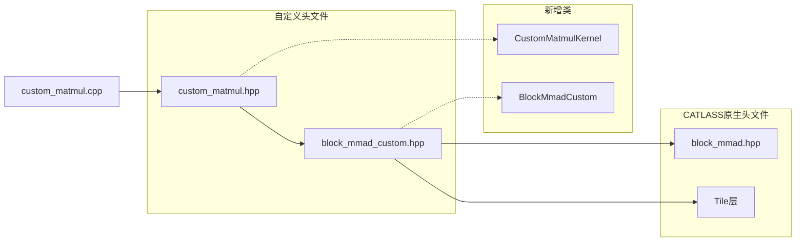

以下为该开发方式的简要介绍，您可进行阅读，确认是否满足当前场景需要；待补充相关代码后，我们将增加这种方式的开发示例。

## 前提条件

假设开发的算子为`custom_matmul`，由于深度定制需要，编写了新的kernel`CustomMatmulKernel`和block_mmad`BlockMmadCustom`。

## 目录结构

```bash
examples/99_custom_matmul/
├── catlass_custom
│   ├── block
│   │   └── block_ mmad_custom.hpp
│   └── kernel
│       └── custom_matmul.hpp
└── custom_matmul.cpp
```

调用关系如下：



## 关键适配

### block_mmad_custom.hpp

```cpp
// 包含`block_mmad.hpp`以获取`BlockMmad`的基础定义
#include <catlass/gemm/block/block_mmad.hpp>
```

### custom_matmul.hpp

```cpp
// 不必引用原生的`block_mmad.hpp`，引用自定义的头文件
#include <catlass_custom/block/block_mmad_custom.hpp>
```

### custom_matmul.cpp

```cpp
// 正常调用
#include <catlass_custom/kernel/custom_matmul.hpp>
```

### 编译选项

#### bisheng命令行

```bash
bisheng -x asc -I/path/to/catlass_custom -I/path/to/catlass ...
```

#### CMakeLists.txt

```cmake
# ...
include_directories(
    ${PATH_TO_CATLASS_CUSTOM}
    ${PATH_TO_CATLASS}
)
# ...
```

## 要点

- CATLASS内置模板：`block_mmad.hpp`->`block_mmad_xxx.hpp`
- 自定义模板：`block_mmad_custom.hpp`->`block_mmad.hpp`
- 保证编译选项中，自定义头文件在内置头文件**前**搜索
